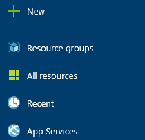
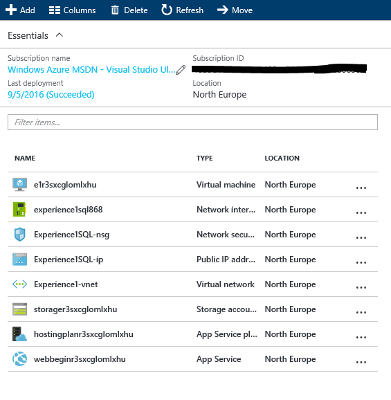
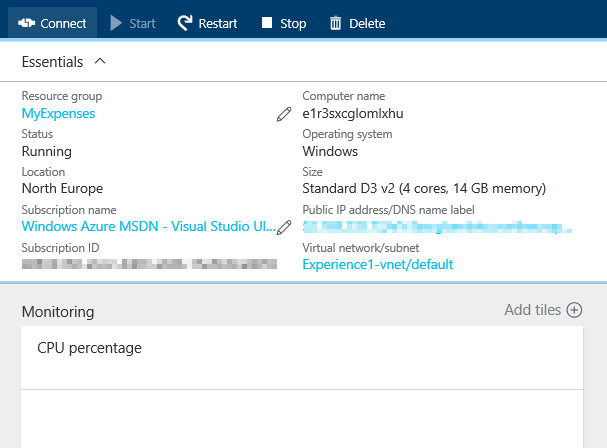
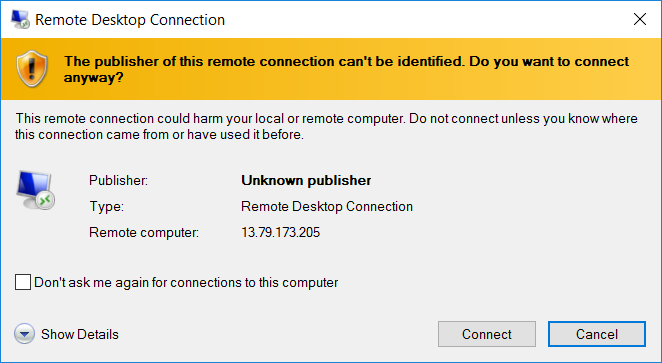
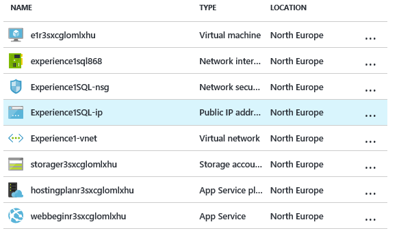
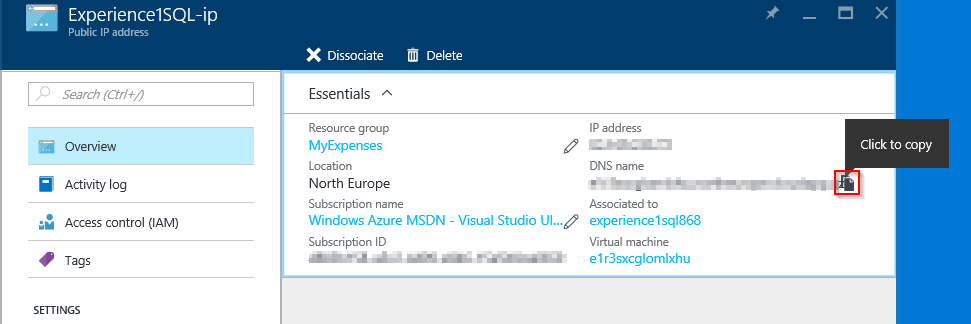

<page title="Getting started"/>

GETTING STARTED
====

1. There are some small configuration steps that you need to go through before getting on with the labs. To begin, go the Azure Portal and click on the "Resource groups" section.

    

2. You should see a resource group with the name you provided previously. Click on it.

    

3. Inside of the resource groups there are all the elements that the AzureARM template has automatically deployed. One of them is the virtual machine where the SQL Server is installed. It appears with the name "e1" followed by a generated string that may vary. In our case, the name is "e1r3sxcglomlxhu" and with the type as "Virtual Machine". Click on it.

    

4. In the newly opened section, click on the Connect button.

    

5. It will download a remote desktop connection file to connect to the virtual machine. Click on connect.

    

6. The credentials to connect are, by default, "experience1" as a local user and "P2ssw0rd@Dev" as password.

7. Inside the resource group there is a resource named "Experience1SQL-ip". Click on it.

    

8. In the overview there is a field named "DNS Name". This is the public name of the virtual machine, and you'll need it to connect to the SQL Server instance later.

    

> Copy the value of the DNS name because it will be required for next step