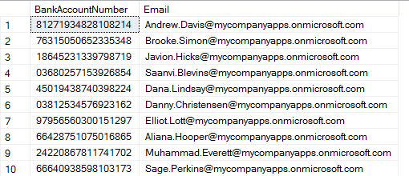

<page title="Checking how the data is stored currently"/>

CHECKING HOW THE DATA IS STORED CURRENTLY
====

We'll start by checking how the fields BankAccountNumber and Email are being shown at the moment for all users.

1. Connect to your database using SQL Server Management Studio or SQL Server Data Tools

    You must be connected to the expenses database on the SQL Server 2016 that has been deployed into a VM, with the administrative login. Check the setup step to get the DNS name of the created VM. For example, the login screen for SQL Server Management is:

     

    The default SQL credentials are: experience1/P2ssw0rd@Dev
        
    Once you are connected to the SQL Server, press right button over "Expenses" database and select "New Query"

     

    This will allow you to execute queries to "Expenses" database.

2. Execute the following SQL statement to select both the BankAccountNumber and Email fields for all the users, when logged in as an administrator

    ```sql
    SELECT BankAccountNumber, Email FROM [Expense].[Employee];
    ```

3. Check the results, and see how all the information is available. This is what we need to avoid.

    

    Since DDM is applied to specific database users, we'll create a new non-privileged user for the IT team which will see only masked data in sensitive fields. 

4. Create a new login, that will be used for the IT department. Nobody in IT needs to see the unmasked email or account number of the users when troubleshooting an issue in the application, but without DDM, that's not what happens. Execute the following SQL sentences to create the new itemployee user.

    ```sql
    CREATE LOGIN itemployee WITH password='P2ssw0rd@Dev'; 
    CREATE USER itemployee FROM LOGIN itemployee;
    ```

5. Grant the newly created user read-only access to the database

    ```sql
    EXEC sp_addrolemember 'db_datareader', 'itemployee'; 
    ```

6. Connect to MyExpenses again, using SQL Server Management Studio or SQL Server Data Tools. This time however, use the read only login that you just created. We want to see what the IT department sees.

    The SQL credentials are: itemployee/P2ssw0rd@Dev

7. Check the results again, and see how all the information is available, just as before

    
