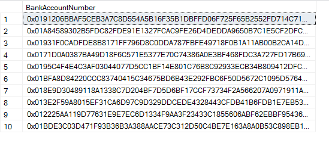

<page title="Encrypting the BankAccountNumber column"/>

ENCRYPTING THE BANKACCOUNTNUMBER COLUMN
====

The next step is to modify the AccountNumber column to be encrypted using the previously created encryption key. Since the basis of Always Encrypted is that the database system is not aware of the encryption keys, and out Employee table already has data, you have a problem. Even though it's possible to define an encrypted column using T-SQL on a CREATE TABLE statement, it's not possible to move the data there, since SQL Server doesn't know how to encrypted: it's supposed not to know! What you're going to do is define the encrypted column using a PowerShell script.

1. Set the value for *{YOUR_DATABASE_SERVER}* with the url of the SQL machine, and execute the following PowerShell script

	```powershell
	Import-Module SqlServer

	# Load reflected the required SQL assemblies
	[reflection.assembly]::LoadwithPartialName('System.Data.SqlClient') | Out-Null
	[reflection.assembly]::LoadwithPartialName('Microsoft.SQLServer.SMO') | Out-Null
	[reflection.assembly]::LoadwithPartialName('Microsoft.SQLServer.ConnectionInfo') | Out-Null

	# Set up a connection to the Expenses database
	$sqlConnectionString = 'Data Source={YOUR_DATABASE_SERVER};User ID=experience1;Password=P2ssw0rd@Dev;MultipleActiveResultSets=False;Encrypt=False;TrustServerCertificate=True;Packet Size=4096;Application Name="Microsoft SQL Server Management Studio"'
	$sqlConnection = New-Object 'System.Data.SqlClient.SqlConnection' $sqlConnectionString
	$serverConnection = New-Object 'Microsoft.SqlServer.Management.Common.ServerConnection' $sqlConnection
	$smoServer = New-Object 'Microsoft.SqlServer.Management.Smo.Server' $serverConnection
	$smoDatabase = $smoServer.Databases['Expenses']

	# Set up encryption for the BankAccountNumber column
	$encryptionChanges = @()
	$encryptionChanges += New-SqlColumnEncryptionSettings -ColumnName Expense.Employee.BankAccountNumber -EncryptionType Deterministic -EncryptionKey alwaysEncryptedColumnEncryptionKey

	# Execute the PowerShell command
	Set-SqlColumnEncryption -ColumnEncryptionSettings $encryptionChanges -InputObject $smoDatabase
	```

	This script will load the required SQL Server assemblies (the SQL Client, SQL Server Management Objects and Connection Info), setup a connection to the MyExpenses and modify the encryption settings. It commands PowerShell to establish encryption on the BankAccountNumber of the Expense.Employee table, using randomized encryption (since we only want to read and write the field, and not use it for searching, joining or indexing) and the "alwaysEncryptedColumnEncryptionKey" you created previously.

2. Now, go back to the SSMS window and execute the following SQL statement:

	```sql
	SELECT BankAccountNumber FROM [Expense].[Employee];
	```
	
3. Check the results and see how, even logged in with an administrator account, you are unable to see the account numbers of the employees

	

	Now not even the database engine is able to access the encrypted data. The payroll system will need to be updated, in order to be able to view and edit the account number but since Always Encrypted works at the driver level, the application code remains the same: only the connection string, in order to specify that data may be encrypted, and the certificate be specified in order to encrypt and decrypt the data.