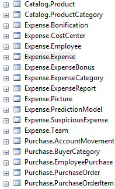
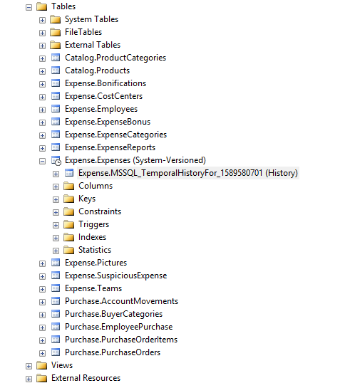
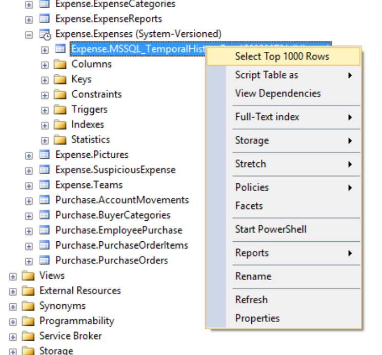
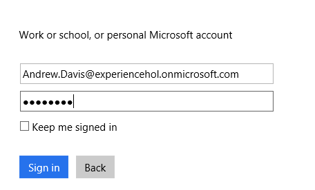
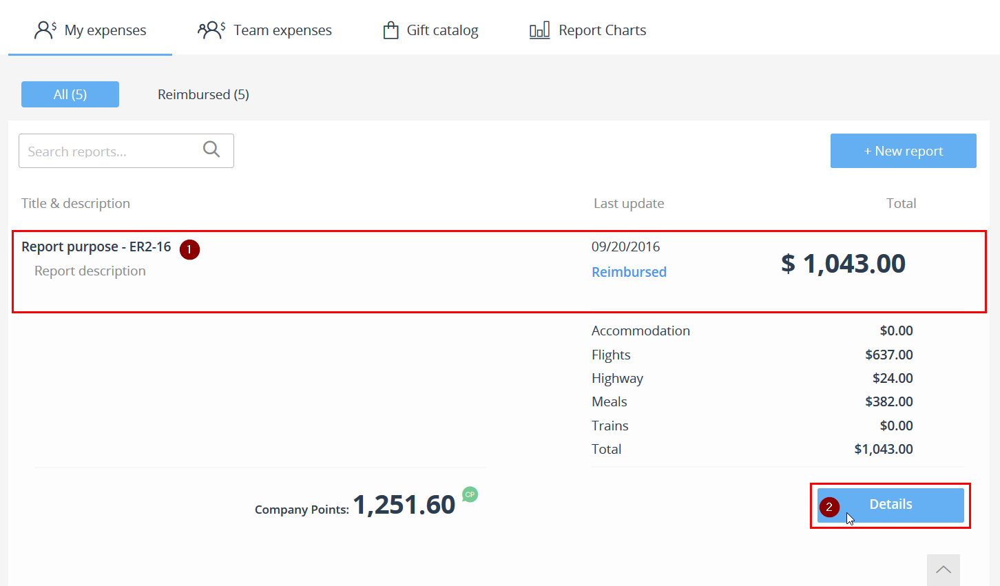
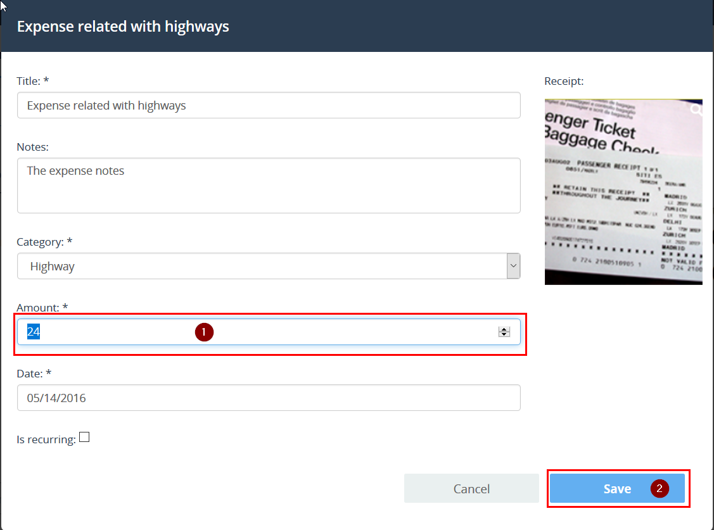

<page title="Creating a temporal table"/>

CREATING A TEMPORAL TABLE
====

In our example we are going to monitoring the Expense table with the aim of tracking changes on the invoices amount. We are going to create a new table and migrate data from the non-temporal to the new one then we made some changes into rows to see what is happening.

1. Connect to your database using SQL Server Management Studio or SQL Server Data Tools

    You must be connected to the expenses database on the SQL Server 2016 that has been deployed into a VM, with the administrative login. Check the setup step to get the DNS name of the created VM. For example, the login screen for SQL Server Management is:

     

    The default SQL credentials are: experience1/P2ssw0rd.

    Once you are connected to the SQL Server, press right button over "Expenses" database and select "New Query"

     

    This will allow you to execute queries to "Expenses" database.

2. Expand databases and check the Expense.Expense table
 
	

3. Open a new Query
 
	

4. Copy and execute the follow T-QSL statement to create the new temporal Expense table:  

	```sql
	CREATE TABLE [Expense].[ExpenseTemporal](
		[Id] [int] IDENTITY(1,1) NOT NULL,
		[EnabledFrom] [datetime2](7) NULL,
		[EnabledTo] [datetime2](7) NULL,
		[Title] [nvarchar](50) NOT NULL,
		[Notes] [nvarchar](250) NULL,
		[Amount] [float] NOT NULL,
		[ExpenseReportId] [int] NOT NULL,
		[ExpenseCategoryId] [smallint] NOT NULL,
		[ReceiptPicture] [varbinary](max) NULL,
		[Date] [datetime2](7) NOT NULL,
		[SysStartTime] [datetime2] GENERATED ALWAYS AS ROW START NOT NULL,
		[SysEndTime] [datetime2] GENERATED ALWAYS AS ROW END NOT NULL,
		PERIOD FOR SYSTEM_TIME (SysStartTime,SysEndTime),
	CONSTRAINT [PK_ExpenseTemporal.Expense] PRIMARY KEY CLUSTERED(
		[Id] ASC
	)WITH (PAD_INDEX = OFF, STATISTICS_NORECOMPUTE = OFF, IGNORE_DUP_KEY = OFF, ALLOW_ROW_LOCKS = ON, ALLOW_PAGE_LOCKS = ON) ON [PRIMARY]
	)WITH(SYSTEM_VERSIONING = ON (HISTORY_TABLE = Expense.ExpenseHistory))

	GO

	ALTER TABLE [Expense].[ExpenseTemporal] ADD  DEFAULT ('1900-01-01T00:00:00.000') FOR [Date]
	GO

	ALTER TABLE [Expense].[ExpenseTemporal]  WITH CHECK ADD  CONSTRAINT [FK_Expense.ExpenseTemporal_Expense.ExpenseCategories_ExpenseCategoryId] FOREIGN KEY([ExpenseCategoryId])
	REFERENCES [Expense].[ExpenseCategory] ([Id])
	GO

	ALTER TABLE [Expense].[ExpenseTemporal] CHECK CONSTRAINT [FK_Expense.ExpenseTemporal_Expense.ExpenseCategories_ExpenseCategoryId]
	GO

	ALTER TABLE [Expense].[ExpenseTemporal]  WITH CHECK ADD  CONSTRAINT [FK_Expense.ExpenseTemporal_Expense.ExpenseReport_ExpenseReportId] FOREIGN KEY([ExpenseReportId])
	REFERENCES [Expense].[ExpenseReport] ([Id])
	GO

	ALTER TABLE [Expense].[ExpenseTemporal] CHECK CONSTRAINT [FK_Expense.ExpenseTemporal_Expense.ExpenseReport_ExpenseReportId]
	GO
	```

	The new table has SysStartTime and SysEndTime which allows it to save the time when a change has been made. 

5. Let's migrate the data and replace the old table, by executing the following script:  

	```sql
	SET IDENTITY_INSERT [Expense].[ExpenseTemporal] ON
	GO
	-- Copy all the Expense table contents to the ExpenseTemporal table
	INSERT INTO [Expense].[ExpenseTemporal](Id, EnabledFrom, EnabledTo, Title, Notes, Amount, ExpenseReportId, ExpenseCategoryId, ReceiptPicture, Date)
	SELECT 
		Id, 
		EnabledFrom, 
		EnabledTo, 
		Title, 
		Notes, 
		Amount, 
		ExpenseReportId, 
		ExpenseCategoryId, 
		ReceiptPicture, 
		Date
	FROM [Expense].[Expense]

	SET IDENTITY_INSERT [Expense].[ExpenseTemporal] OFF
	GO

	-- Drop the Expense table
	ALTER TABLE [Expense].[ExpenseBonus] DROP CONSTRAINT [FK_Expenses.ExpenseBonus_Expenses.Expenses_ExpenseId]
	GO
	ALTER TABLE [Expense].[SuspiciousExpense] DROP CONSTRAINT [FK_SuspiciousExpense_Expense]
	GO
	DROP TABLE [Expense].[Expense]

	-- Change temporal table name to Expense
	EXEC sp_rename 'Expense.ExpenseTemporal', 'Expense'

	-- Add foreign keys to the new Expense table
	ALTER TABLE [Expense].[ExpenseBonus]  WITH CHECK ADD  CONSTRAINT [FK_Expenses.ExpenseBonus_Expenses.Expenses_ExpenseId] FOREIGN KEY([ExpenseId])
	REFERENCES [Expense].[Expense] ([Id])
	GO

	ALTER TABLE [Expense].[ExpenseBonus] CHECK CONSTRAINT [FK_Expenses.ExpenseBonus_Expenses.Expenses_ExpenseId]
	GO

	ALTER TABLE [Expense].[SuspiciousExpense]  WITH CHECK ADD  CONSTRAINT [FK_Expenses.SuspiciousExpense_Expense] FOREIGN KEY([SuspiciousExpenseId])
	REFERENCES [Expense].[Expense] ([Id])
	GO

	ALTER TABLE [Expense].[SuspiciousExpense] CHECK CONSTRAINT [FK_Expenses.SuspiciousExpense_Expense]
	GO
	```

	The table “Expense” is already tempered and the changes will be tracked every time they happen. Expanding the table will show the historic table that keeps data versioning.

	

	If you check the rows on the historic Table by clicking on *Select Top 1000 Rows*:

	

	You won’t find any row at all. This is because no change has been made yet. But let's open the website, change a Expense and see what happpens.

6. Open the website, by default the url is: http://localhost:8000/ and log in as non-manager user:

		Username: Andrew.Davis@experiencehol.onmicrosoft.com
		Password: P2ssw0rd

	

7. Click on any report name that you want to modify

	

8. Modify the amount and click on Save changes button.

	

9. Right now the value in the Expenses table has changed. But, what happen if we wanted to check the old amount that the expense had? Thanks to the temporal table that we previously created, we can check that querying against the historical table, as follows: 

	```sql
	SELECT *
	FROM Expense.ExpenseHistory
	```

10. To check the current value, create a new query into Microsoft SQL server management studio and execute the following statement:

	```sql
	SELECT *
	FROM Expense.Expense
	WHERE Id=(SELECT TOP(1) Id FROM Expense.ExpenseHistory ORDER BY SysStartTime DESC)
	```

	What this statement does is retrieve the value of the Expense from the current Expenses table whose Id is the one from the last modified Expense. The temporal table has a column called `SysStartTime`, that is just a timestamp that shows the time when the value was modified.