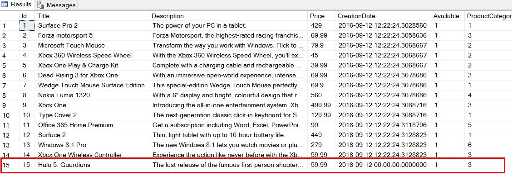
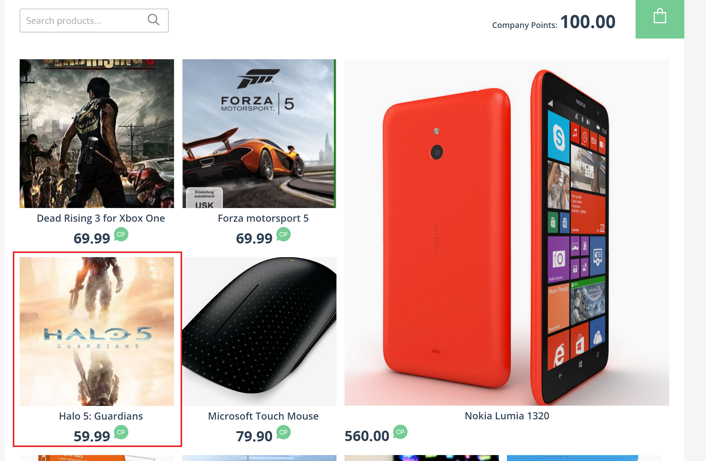

<page title="Inserting data into tables with OPENJSON"/>

INSERTING DATA INTO TABLES WITH *OPENJSON*
====

It is possible to insert new data in a table having a JSON source. Let's say we want to add a new game to the gift catalog, and the input is formatted as JSON. Thanks to `OPENJSON` it is pretty easy to achieve that.

1. Right click on the `Expenses` database and click *New query*

2. Copy and paste the following query.

	```sql
		DECLARE @jsonNewProduct NVARCHAR(MAX) = N'
		{
		"Title": "Halo 5: Guardians",
		"Description":"The last release of the famous first-person shooter video game.",
		"Price": 59.99,
		"CreationDate": "2016-09-12",
		"Available": 1,
		"ProductCategoryId": 3,
		"AdditionalInformation": {
				"Data": {
					"baseImgUrl": "http://thegamesdb.net/banners/",
					"Game": {
						"id": "21335",
						"GameTitle": "Halo 5: Guardians",
						"PlatformId": "4920",
						"Platform": "Microsoft Xbox One",
						"ReleaseDate": "10/27/2015",
						"Overview": "343 Industries continues the legendary first-person shooter series with Halo 5: Guardians -- the first Halo title for the Xbox One gaming platform. Halo 5 featuresthe most ambitious campaign and multiplayer experience in franchise history, all running at 60 frames per second on dedicated servers. A mysterious and unstoppable force threatens the galaxy, the Master Chief is missing and his loyalty questioned. Experience the most dramatic Halo story to date through the eyes of the Master Chief and Blue Team, and Spartan Locke and Fireteam Osiris – in a 4-player cooperative epic that spans three worlds. Challenge friends and rivals in new multiplayer modes: Warzone (massive 24-player battles featuring AI enemies and allies,) and Arena (pure 4-vs-4 competitive combat.)",
						"Genres": {
							"genre": [
								"Action",
								"Shooter"
							]
						},
						"Players": "4+",
						"Co-op": "Yes",
						"Youtube": "http://www.youtube.com/watch?v=HnOX28WaRrE",
						"Publisher": "Microsoft Studios",
						"Developer": "343 Industries",
						"Rating": "8",
						"Images": {
							"fanart": {
								"original": {
									"-width": "1920",
									"-height": "1080",
									"#text": "fanart/original/21335-1.jpg"
								},
								"thumb": "fanart/thumb/21335-1.jpg"
							},
							"boxart": {
								"-side": "front",
								"-width": "771",
								"-height": "1080",
								"-thumb": "boxart/thumb/original/front/21335-1.jpg",
								"#text": "boxart/original/front/21335-1.jpg"
							},
							"screenshot": {
								"original": {
									"-width": "1920",
									"-height": "1080",
									"#text": "screenshots/21335-1.jpg"
								},
								"thumb": "screenshots/thumb/21335-1.jpg"
							}
						}
					}
				}
			}
		}';
		IF ISJSON(@jsonNewProduct) > 0
		BEGIN
			INSERT INTO [Catalog].[Product]
			SELECT * FROM OPENJSON(@jsonNewProduct)
			WITH(
				[Title] NVARCHAR(50),
				[Description] NVARCHAR(500),
				[Price] FLOAT,
				[CreationDate] DATETIME2(7),
				[Available] BIT,
				[ProductCategoryId] SMALLINT,
				[LargePicture] VARBINARY(MAX),
				[ThumbnailPicture] VARBINARY(MAX),
				[AdditionalInformation] NVARCHAR(MAX) AS JSON
			);
		END;
	```

	Before executing the code, let's see what it does.

	We use `ISJSON` to ensure that the JSON object that we are going to parse is correctly formatted.

	`OPENJSON` transforms a JSON object to one or more rows. These rows can be imported into tables or they can be used to update existing records in tables. We want to insert new records so `OPENJSON` is useful here.

	What we are doing is inserting into the Products table the result of the `SELECT` statement.
	`OPENJSON` reads the text stored in the `@jsonNewProduct` parameter, following the structure contained in the WITH statement. What we have done here is use the same structure that the table has, so we won’t have any problems later. As you can see, it is as simple as defining the name of the column, followed by the column type. And, in case that the name of the JSON property had a different name than the column, we need to indicate that name. For example, if we wanted to store in the `Title` column a property called `ProductName` in the JSON, we would type:
	`Title NVARCHAR(50) $.ProductName`. Again, as we saw before, `$` is used to refer to the root of the JSON, and from there we specify the path to the desired property.

	If we want to store a whole JSON snippet in a column, which is the case of AdditionalInformation, we must specify it. We do so with the `AS JSON` statement.
	When the `SELECT` query runs, it will parse the JSON variable to a tablet format. However, this is just the result of parsing the JSON to a table, using the column names we have declared in the `WITH`. We insert the result of this `SELECT` in the products table with the `INSERT TO` statement at the beginning. If all the columns match, the insert will be processed succesfully. 

3. Execute the query.
4. If all went right, you should see the new product in the Products table!

	

5. Now if you run the application and go to the gift catalog, you will see the new product! 

	 