<page title="Exploring the dataset"/>

EXPLORING THE DATASET
====

In this section we are going to explore the dataset and evaluate the options we have when it comes to choosing a machine learning algorithm. In order to do so, we are going to get a sample of the dataset and explore it using R Tools for Visual Studio.

1. Open the SQL Server Import and Export Data application

	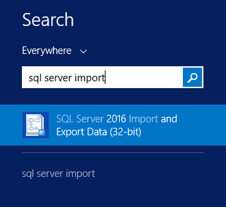

	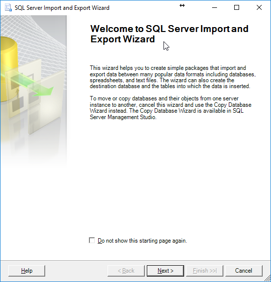

2. Press next and connect to the Expenses database
 
	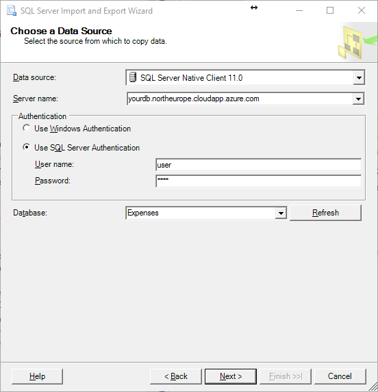

	You will need the server name to connect (the DNS name that appears in setup) and the default credentials to connect:
		- experience1 / P2ssw0rd

	Note that in the screenshot, the "Expenses" database is selected.

3. As a destination choose *Flat File Destination* and provide a valid path

	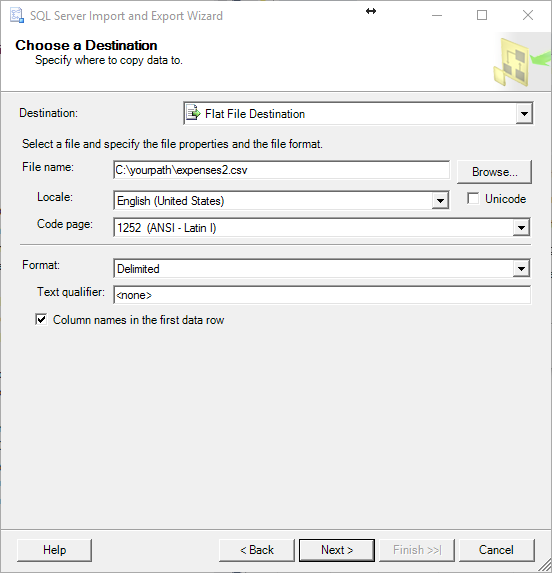

4. Choose *Write a query to specify the data to transfer* option and provide the following query

	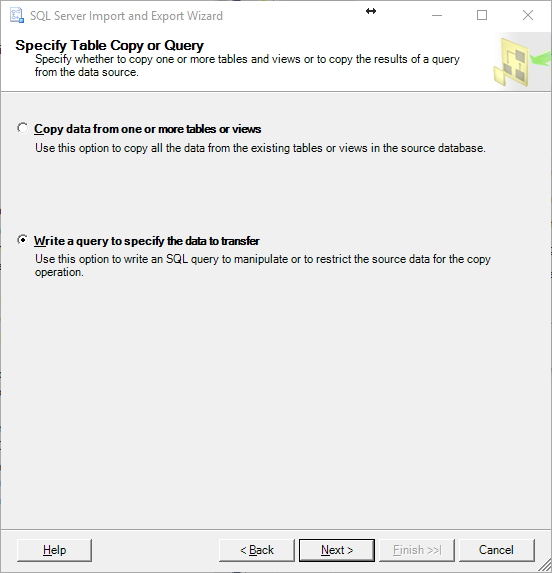

	```sql
	SELECT Amount, ExpenseCategoryId,
	CASE
		WHEN se.SuspiciousExpenseId is not null
		THEN 1
		ELSE 0
		END as IsSuspicious
	FROM [Expense].[Expense] e
	LEFT JOIN Expense.SuspiciousExpense se
	on e.Id = se.SuspiciousExpenseId
	```

5. It should look like this:

	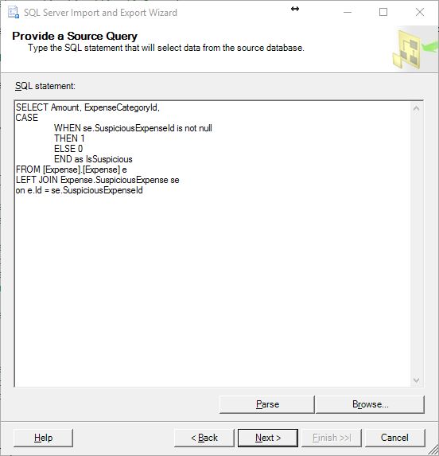

6. Then follow the wizard until the end

Once the dataset has been exported from the Expenses database, it's time to open Visual Studio

USING R TOOLS FOR VISUAL STUDIO
====

1. Let's create a new R project

	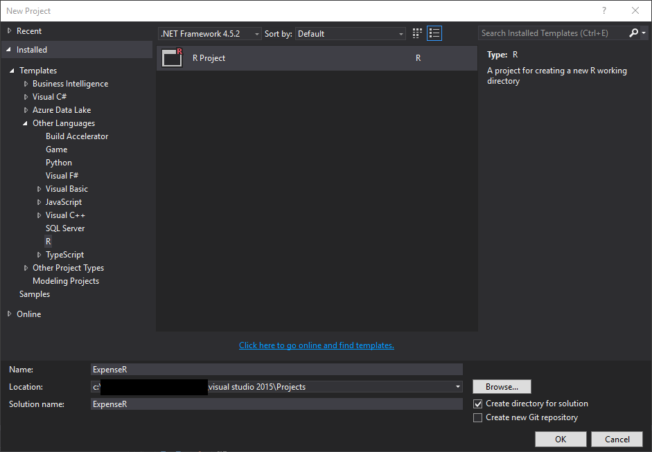

2. Copy the expenses file that you exported in the previous steps to the workspace. Then, copy the item path and set the project as current workspace

	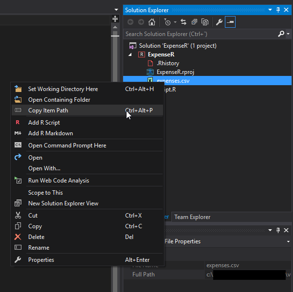

	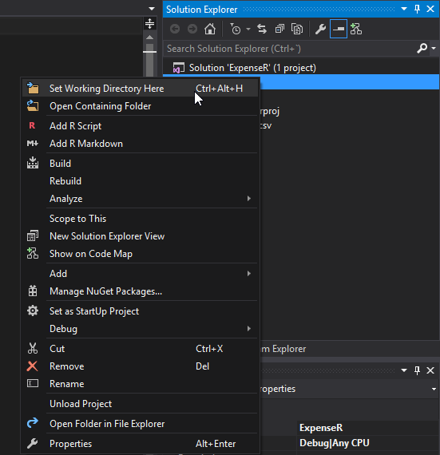

3. Double clicking the exported file is an easy way to see it's contents. In this case we should see something like this:

	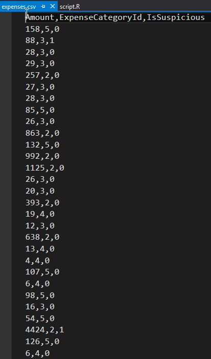

4. As explained in the previous section, we are going to use a Decision Tree. It is always a good thing to check how the model fits our dataset, so we are going to perform a model training and, after that, we are going to visualize the outcome. Before doing this, we must install the visualizing libraries. Open the R interactive tab and execute:
	
	```
	install.packages("ggplot2", dep = T)
	install.packages("rpart")
	install.packages("rpart.plot")
	install.packages("rattle")
	install.packages("RColorBrewer")
	```

5. Once the libraries are installed, we can test out R script. Copy and paste the following script to Visual Studio:

	```
	#import libraries
	library("rpart")
	library("rpart.plot")
	library("rattle")
	#load expenses as CSV
	inputdata <- read.csv("~/visual studio 2015/Projects/ExpenseR/ExpenseR/expenses.csv", header = TRUE)
	#train the model using a decision tree (rpart library)
	model.tree <- rpart(IsSuspicious ~ ., data = inputdata, method = "class")
	#plot the model using prp
	prp(model.tree)
	```

	**Note**: *Use the path copied before as parameter in the read.csv() method*
	
6. Press *Source startup file* in order to execute the script

	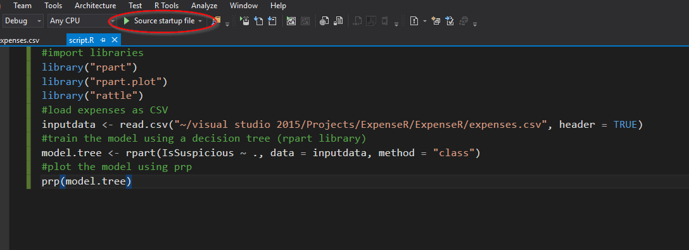

7. And you should see something like this:

	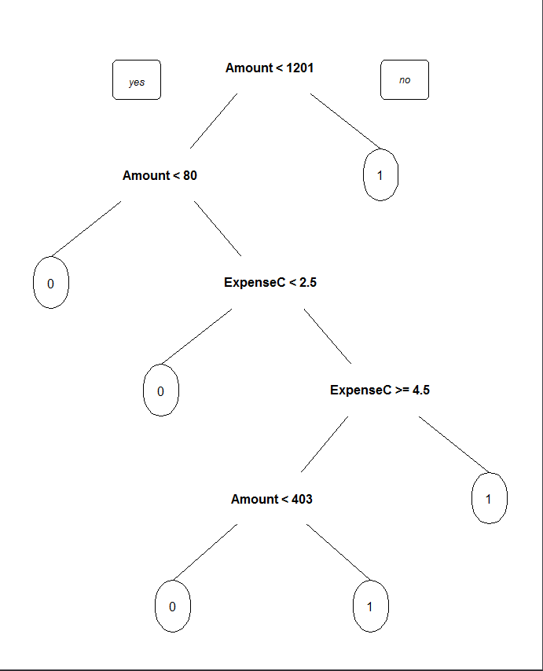

	As you can see, the prp() method plots the trained model in human-readable fashion. In this case we are able to analyze graphically how the model is going to evaluate a given expense depending of the amount and category.

8. This is a very basic visualization. We can change the prp method with the following

	```
	fancyRpartPlot(model.tree,main="", "Greens for suspicious, reds for non-suspicious", palettes = c("Reds", "Greens"))
	```

	And the result should be something like this:

	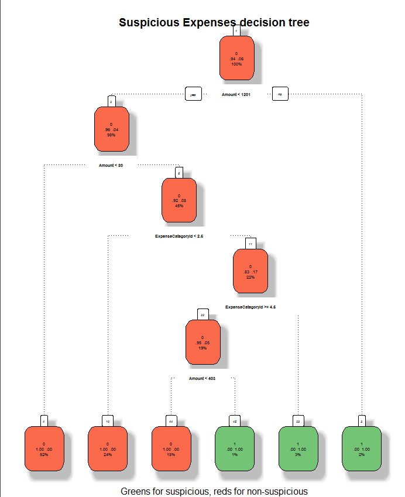

	This visualization is way more descriptive compared to the default prp() one. It's interesting to note that the percent inside each leaf means the likelihood of an expense to be in that state. Also, this visualization is easier to customize when it comes to title, subtitle and colors.

9. After this analysis, we are good to go to SQL Server and adapt our script to the SQL Server R execution engine.