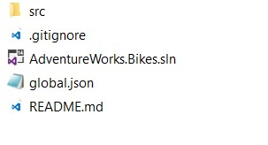
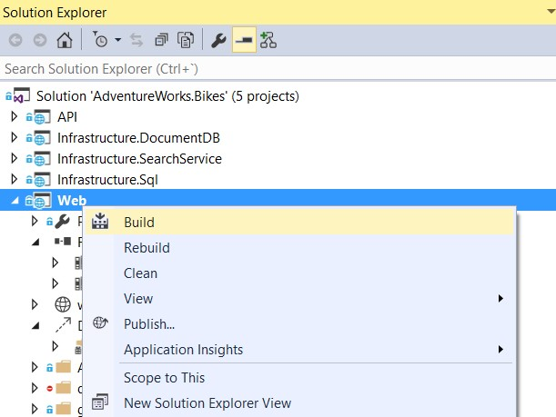
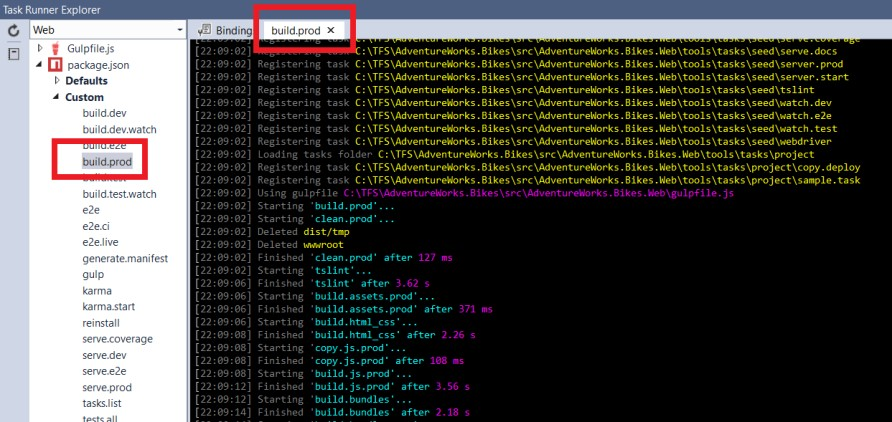
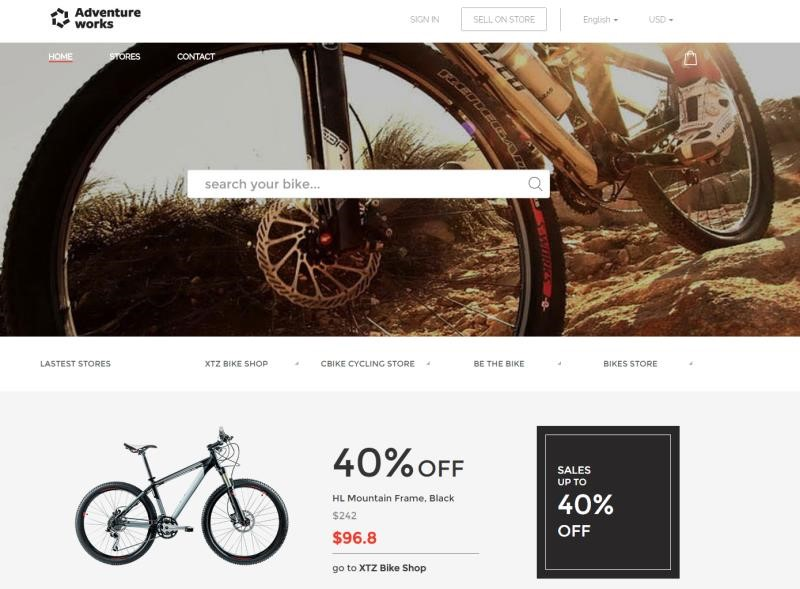
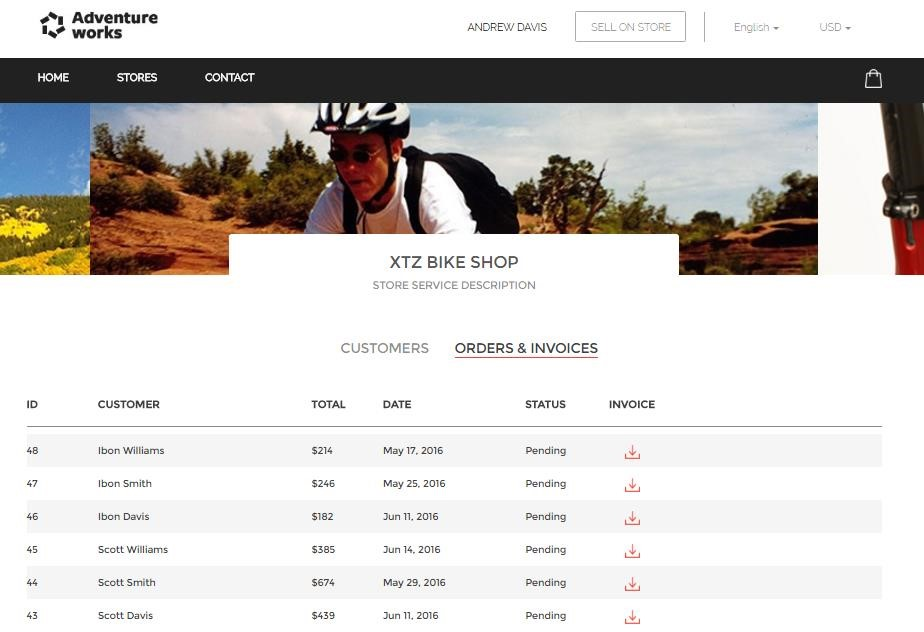
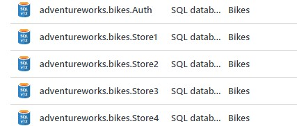
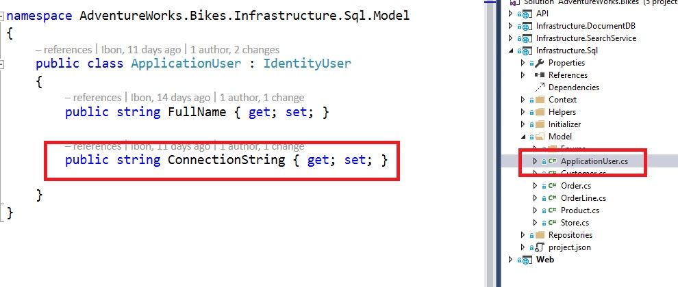

# GET STARTED

1. Open Visual Studio.

1. Open the `AdventureWorks.Bikes` solution. (source\AdventureWorks.Bikes directory)

    > **NOTE:** The first time you open the Visual Studio solution will restore the web project dependencies. 

    

1. Build de Web App. 

    > **NOTE:** If Visual Studio shows this message "An item with the same key has already been addedd", remove the project.lock.json file from the project that generates the message and try again.

    

1. Open the Task Runner Explorer. 

1. Run the build.prod npm task.

    > You must run the build.prod npm task after completing any change in the front-end.

    

1. Set the web project as StartUp project. 
1. Click on F5 or in the `IIS Express` button. 

    > Don´t worry if the application doesn´t show information or you get any connection issue.  

    
    

1. Click on `Sign in` to access to the store private area. 

    

1. By default, these are the credentials: 
    > Username: Store1 

    > Pasword: P2ssw0rd@1 

    > Every store has their own database, separate from everyone else so when we access to the private area we only show the data related to the store. 

    

1. Stop debugging. 

    

1. Open the Azure Portal and go to your Resource Group. 

1. Hightlight the existing databases. 

    > Each store gets a separate instance of the database. 
    The web app, depending on the store logged, connects to the right database

    

1. Click on `ApplicationUser.cs` (Infrastructucture.Sql>Model).

    > The Auth database contains all the valid credentials and the connection string to use to connect to the store database. 
    
    > **Disclaimer:** This demo is a very basic app. It´s not a reference app about how to develop a SaaS single-tenant platform. In the next steps we will see different tools to use in our application related to this point. 

    

1. Click on `BikesContextBuilder.cs` (Infrastructucture.Sql>Helpers).

    > Depending on the logged user the application gets the connection string from the Auth database. 

    

1. Click on `SqlCustomersRepository.cs` (Infrastructucture.Sql>Repositories).

    > The repositories have a contextbuilder dependency to create the EF context. 

    

1. Click on `SqlOrdersRepository.cs` (Infrastructucture.Sql>RepositoriesModel).

    > The repositories have a contextbuilder dependency to create the EF context. 

    

<a href="2.VerticalScaling.md">Next</a>
