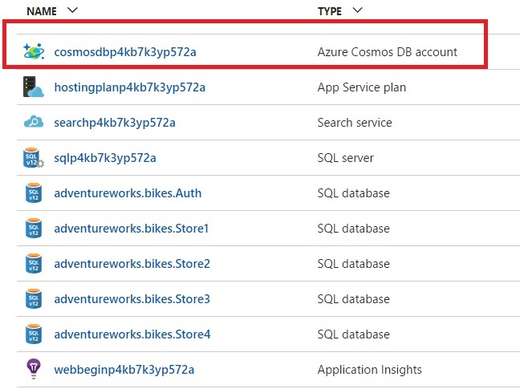
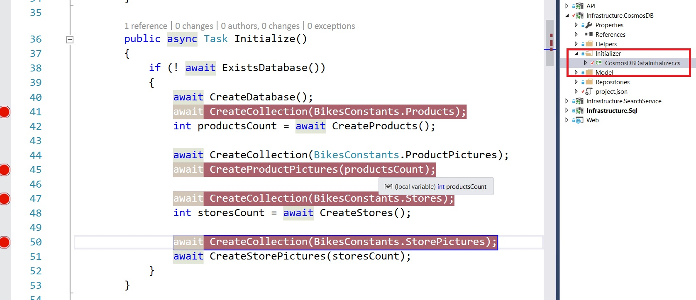

# UPDATING THE COSMOS DB DATABASE

1.	Go to the Azure portal.	Throughout this document, you will see that there are parts of de application that you will have to complete.

    > When applying changes to the source code, you will need to follow several steps to see those changes reflected on the Azure Cosmos DB database.

    > This section explains you how to do it.

1. Click on the resource group created.

1. Click on the Cosmos DB account.	

    > When the application starts, it invokes a initializer which is in charge of creating the database and all the collections attached to it.

    > However, if the database already exists, it will not do anything. So, to apply any changes you do, you will need to delete the Cosmos DB database first.

    

1. Right click on the database.

1. Click on Delete Database adventureworks.bikes.

    

1.  When it is successfully deleted, run the application again and it will create the database with the changes made to the code.

    > The application must create 4 collections. To be sure that the collections are created, add breakpoints in the DocumentDBDataInitializer.cs file.

    

<a href="3.Database.md">Next</a>
