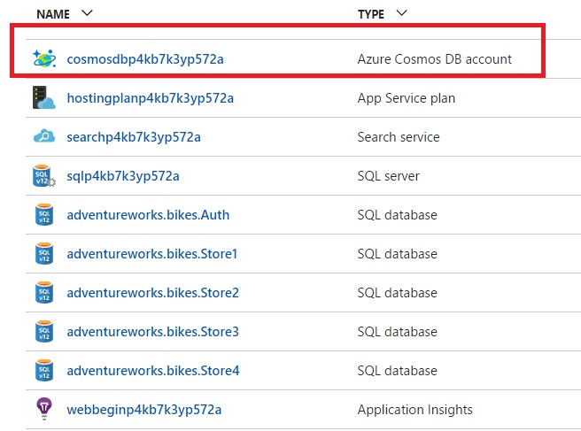
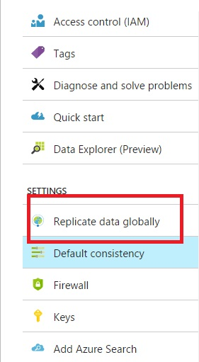
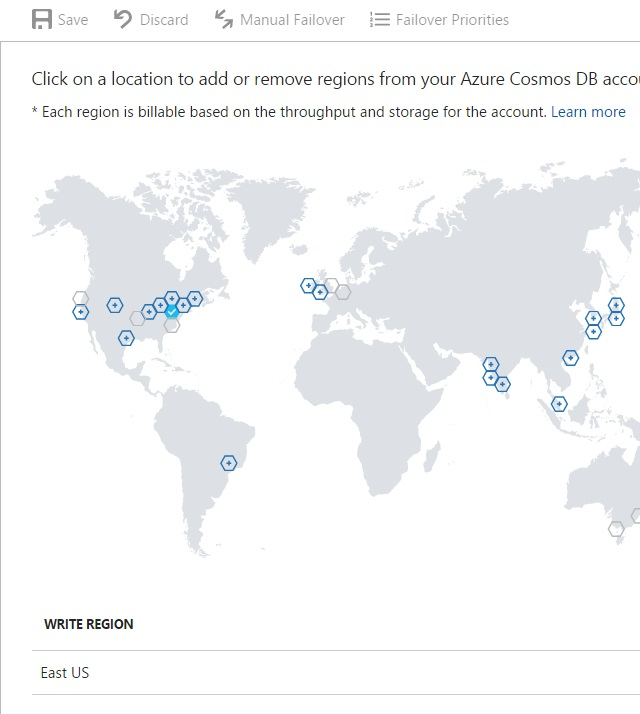

# GLOBAL DATABASE REPLICATION

As a globally distributed database system, Cosmos DB simplifies the global distribution of data by offering fully managed, multi-region database accounts that provide clear tradeoffs between consistency, availability and performance, all with corresponding guarantees.

Cosmos DB is available in most Azure regions. After selecting the default consistency level for your database account, you can associate one or more regions (depending on your choice of default consistency level and global distribution needs).

1.	Click on the Cosmos DB service.	

	

1.	Click Add/Remove Regions.

	

1.  Select the regions to add or remove.

	> When configuring two or more regions, it is recommended that regions are selected based on the region pairs described in the Business continuity and disaster recovery (BCDR): Azure Paired Regions article.

	> https://azure.microsoft.com/en-us/documentation/articles/best-practices-availability-paired-regions/ 

	> Specifically, when configuring to multiple regions, make sure to select the same number of regions (+/-1 for odd/even) from each of the paired region columns. For example, if you want to deploy to four US regions, you select two US regions from the left column and two from the right. So, the following would be an appropriate set: West US, East US, North Central US, and South Central US.

	

1.	Click OK.	

<a href="10.GeoSpation.md">Next</a>

