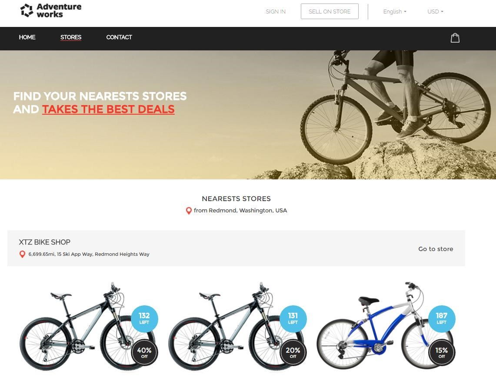
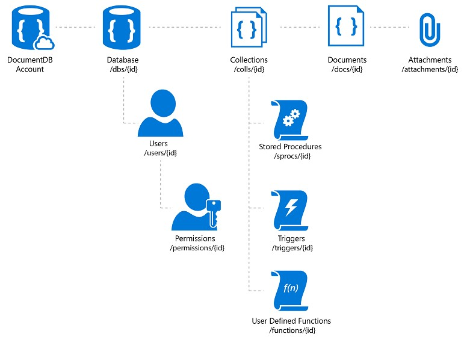

# OVERVIEW

AdventureWorks Bikes is an ecommerce SaaS platform focused on helping bikes stores run better in the "cloud"—without the headaches and inefficiencies of disconnected and costly in-house IT systems for finance, order and inventory management, ecommerce and more.

From the customer point of view the Bike Store aggregates the information of all the stores to provide a unified shopping experience. The public web portal allows the customers to search the existing products across stores and show the best offers for the customer.

Cosmos DB is the primary data store for our product catalogue. AdventureWorks identifies early the need to support an ever changing product definition, maintain multiple product prices for customers in different countries and provide a fast query response. Through the use of functionality provided by Cosmos DB we can easily meet these needs.

 
# COSMOS DB OVERVIEW

Azure Cosmos DB offers turnkey global distribution across any number of Azure regions by transparently scaling and replicating your data wherever your users are. Elastically scale throughput and storage worldwide, and pay only for the throughput and storage you need. 

Azure Cosmos DB guarantees single-digit-millisecond latencies at the 99th percentile anywhere in the world, offers multiple well-defined consistency models to fine-tune performance, and guarantees high availability with multi-homing capabilities—all backed by industry-leading, comprehensive service level agreements (SLAs).

## Hierarchical resource model

As the following diagram illustrates, the Cosmos DB hierarchical resource model consists of sets of resources under a database account, each reachable via a logical and stable URI. A set of resources will be referred to as a feed in this article.
 

In order to start working with resources, you must create a Cosmos DB database account using your Azure subscription. A database account can consist of a set of databases, each one containing multiple collections and each collection may contain stored procedures, triggers, UDFs, documents and related attachments (preview feature). A database also has associated users, each one with a set of permissions to access collections, stored procedures, triggers, UDFs, documents or attachments. While databases, users, permissions and collections are system-defined resources with well-known schemas, documents and attachments contain arbitrary, user defined JSON content.

# UPDATE THE WEB APP CONFIGURATION FILE

1. Open the `<your_repo_directory>\source\AdventureWorks.Bikes\src\AdventureWorks.Bikes.Web` directory.

1. Open the `appsettings.json` file.

1. Replace the tokens with the right configuration.
    
    - `YOUR_DEFAULT_CONNECTION` 
    - `YOUR_IDENTITY_CONNECTION` 
    - `YOUR_INSTRUMENTATION_KEY` 
    - `YOUR_SEARCH_SERVICE_NAME` 
    - `YOUR_SEARCH_SERVICE_KEY` 
    - `YOUR_COSMOSDB_ENDPOINT` 
    - `YOUR_COSMOSDB_KEY` 

<a href="0.Tour.md">Next</a>