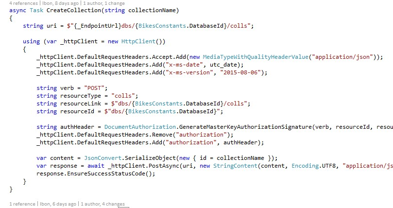

# COLLECTIONS

1. Click on DocumentDBDataInitializer.cs (Infra.DocumentDB>Initializer).	

    > AdventureWorks has four different collections that are created in the Initialize method using the REST API.
    
    

1. Scroll down.

1. Find the CreateCollection method.

    

    > A new collection can be created under the database by executing an HTTPS POST request against the URI resource path colls.

    > AdventureWorks has four different collections that are created in the Initialize method using the REST API. 

    > Right now the method that creates the collections is empty. You will have to complete it so they are properly created.

1. Copy and paste the code inside it.

    ```csharp
            string uri = $"{_EndpointUrl}dbs/{_DatabaseId}/colls";

            using (var _httpClient = new HttpClient())
            {
                _httpClient.DefaultRequestHeaders.Accept.Add(new MediaTypeWithQualityHeaderValue("application/json"));
                _httpClient.DefaultRequestHeaders.Add("x-ms-date", utc_date);
                _httpClient.DefaultRequestHeaders.Add("x-ms-version", "2015-08-06");

                string verb = "POST";
                string resourceType = "colls";
                string resourceLink = $"dbs/{_DatabaseId}/colls";
                string resourceId = $"dbs/{_DatabaseId}";

                string authHeader = DocumentAuthorization.GenerateMasterKeyAuthorizationSignature(verb, resourceId, resourceType, _Key, "master", "1.0", utc_date);
                _httpClient.DefaultRequestHeaders.Remove("authorization");
                _httpClient.DefaultRequestHeaders.Add("authorization", authHeader);

                var content = JsonConvert.SerializeObject(new { id = collectionName });
                //string[] paths = { "/city" };
                //var content = JsonConvert.SerializeObject(
                //    new
                //    {
                //        id = collectionName,
                //        partitionKey = new
                //        {
                //            paths = paths,
                //            kind = "Hash"
                //        }
                //    }
                //);
                var response = await _httpClient.PostAsync(uri, new StringContent(content, Encoding.UTF8, "application/json"));
                response.EnsureSuccessStatusCode();
            }	
    ````

1.  Your method should look as shown in the image.

    

1. POST https://{databaseaccount}.documents.azure.com/dbs/{db-id}/colls		

    > The {databaseaccount} is the name of the DocumentDB account created under your subscription. 

    > The {db-id} value is the user generated name/id of the database where the collection will be created (not the system generated id (rid) of the database).

1.  Update the DocumentDB database.

1. 	Run the application	after ensuring that the web project is marked as "Startup Project".

<a href="5.Documents.md">Next</a>

 
