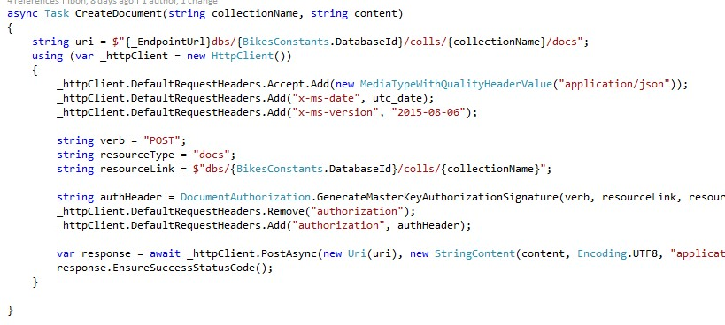

# DOCUMENTS

1.	Click on DocumentDBDataInitializer.cs (Infra.DocumentDB>Initializer).	

    > DocumentDB does not mandate any schema and does not require secondary indexes in order to support querying over documents in a collection. All document properties are automatically indexed by default.

    > AdventureWorks manages four different documents:
    > - Products.
    > - Store.
    > - ProductPictures.
    > - StorePictures.

1. Scroll down

1. Find the CreateDocument method.	

    

    > The method is empty, so currently it is not possible to add products and stores information to the database!

    > Let’s fix that!

1. Copy and paste the code inside it.

    ```csharp
            string uri = $"{_EndpointUrl}dbs/{BikesConstants.DatabaseId}/colls/{collectionName}/docs";
            using (var _httpClient = new HttpClient())
            {
                _httpClient.DefaultRequestHeaders.Accept.Add(new MediaTypeWithQualityHeaderValue("application/json"));
                _httpClient.DefaultRequestHeaders.Add("x-ms-date", utc_date);
                _httpClient.DefaultRequestHeaders.Add("x-ms-version", "2015-08-06");

                string verb = "POST";
                string resourceType = "docs";
                string resourceLink = $"dbs/{BikesConstants.DatabaseId}/colls/{collectionName}";

                string authHeader = DocumentAuthorization.GenerateMasterKeyAuthorizationSignature(verb, resourceLink, resourceType, _Key, "master", "1.0", utc_date);
                _httpClient.DefaultRequestHeaders.Remove("authorization");
                _httpClient.DefaultRequestHeaders.Add("authorization", authHeader);

                var response = await _httpClient.PostAsync(new Uri(uri), new StringContent(content, Encoding.UTF8, "application/json"));
                response.EnsureSuccessStatusCode();
            }	
    ```

1. Your method should look as shown in the image.

    

1. POST https://{databaseaccount}.documents.azure.com/dbs/{db-id}/colls/{coll-id}/docs		

    > The {databaseaccount} is the name of the DocumentDB account created under your subscription. 

    > The {db-id} value is the user generated name/id of the database, not the system generated id (rid). 

    > The {coll-id} value is the collection name that contains the document.

1. Update the DocumentDB database.
1. Run the application	

<a href="6.Query.md">Next</a>