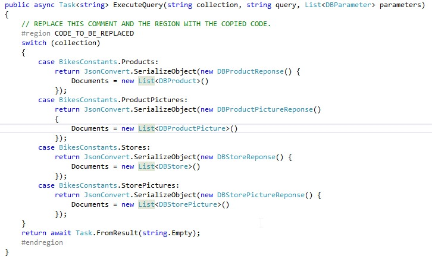
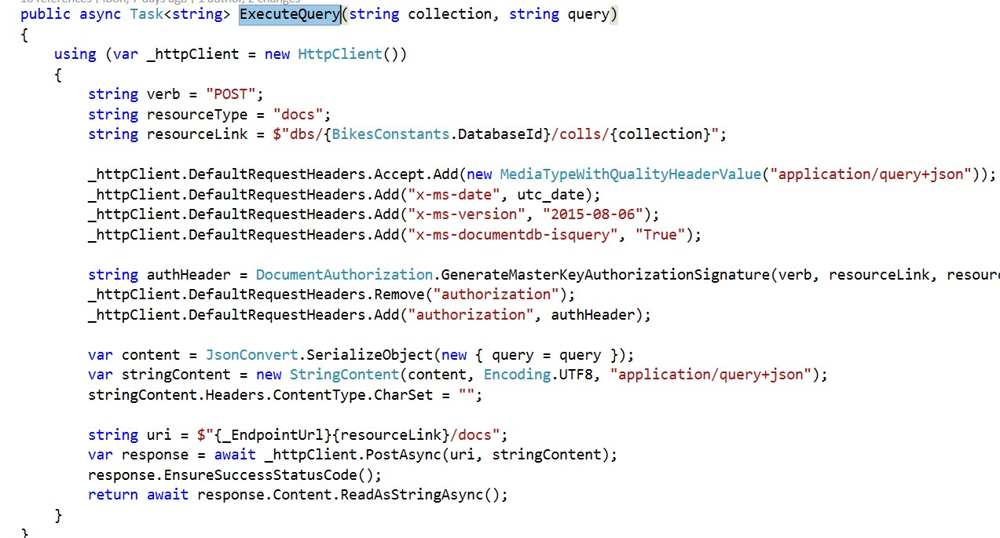

# QUERY

1. Click on DBStoresRepository.cs (Infra.DocumentDB>Repositories).	

    > The public web portal uses DocumentDB and Search Service to provice the best experience for the customer.

    > The DocumentDB project contains several repositories that query the JSON documents in a collection.

    

1. Highlight the GetAsync method.

1. Right click on ExecuteQuery.

1. Click on Go to definition.	

    > The SQL syntax of DocumentDB provides hierarchical, relational, and spatial query operators to query and project documents.

    

    > The repositories use the method ExecuteQuery, that will submit a query to a collection. 

    > Now it is empty, so nothing on the repositories that rely on this method will work. It is now the perfect time to complete it.

    

1. Copy and paste the code inside it, replacing the region CODE_TO_BE_REPLACED

    ```csharp
        using (var _httpClient = new HttpClient())
        {
            string verb = "POST";
            string resourceType = "docs";
            string resourceLink = $"dbs/{BikesConstants.DatabaseId}/colls/{collection}";

            _httpClient.DefaultRequestHeaders.Accept.Add(new MediaTypeWithQualityHeaderValue("application/query+json"));
            _httpClient.DefaultRequestHeaders.Add("x-ms-date", utc_date);
            _httpClient.DefaultRequestHeaders.Add("x-ms-version", "2015-08-06");
            _httpClient.DefaultRequestHeaders.Add("x-ms-documentdb-isquery", "True");

            string authHeader = DocumentAuthorization.GenerateMasterKeyAuthorizationSignature(verb, resourceLink, resourceType,         _Key, "master", "1.0", utc_date);
            _httpClient.DefaultRequestHeaders.Remove("authorization");
            _httpClient.DefaultRequestHeaders.Add("authorization", authHeader);

            var content = JsonConvert.SerializeObject(
                new
                {
                    query = query,
                    parameters = parameters
                });

            var stringContent = new StringContent(content, Encoding.UTF8, "application/query+json");
            stringContent.Headers.ContentType.CharSet = "";

            string uri = $"{_EndpointUrl}{resourceLink}/docs";
            var response = await _httpClient.PostAsync(uri, stringContent);
            return await response.Content.ReadAsStringAsync();
        } 
    ```


1. Your method should look as shown in the image now.

    

1. POST https://{databaseaccount}.documents.azure.com/dbs/{db-id}/colls/{coll-id}/docs		

    > The {databaseaccount} is the DocumentDB account name created under your subscription. 

    > The {db-id} value is the user generated name/id of the database, not the system generated id (rid). 

    > The {coll-id} value is the name of the collection.

1. Run the app (no need to update the DocumentDB database this time!).	


<a href="7.PartitionScale.md">Next</a>
 
