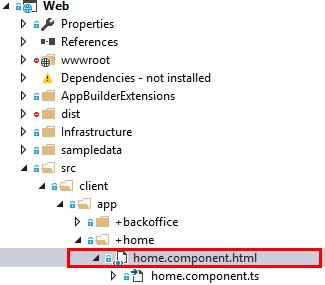
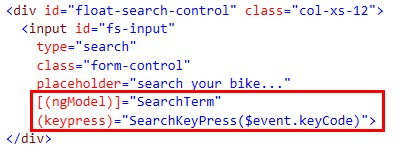
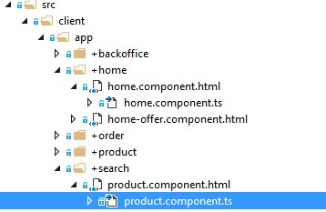
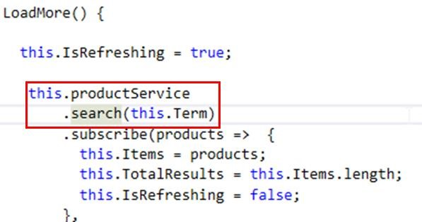
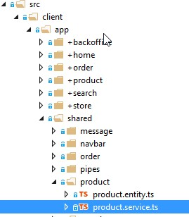

# BINDING AZURE SEARCH TO THE FRONT-END

1.	Expand the search folder

1.	Open home.component.html.	

	

	> AdventureBikes front-end is build using Angular 2.

	> We will explain in this section how to bind the search service to the front-end.
 	
	

  	> The home component contains the search bar used in the application, which is the div with the id float-search-control.

	> What this does is binding the term that typed in the input to the component, so that when the user hits a key, the SearchKeyPress method is executed.

1.	Open home.component.ts.	

	> SearchKeyPress just check that the user has hit enter, and opens the route /search/SearchTerm.

	

1.	Open product.component.ts, located in the search folder.	

	

	> The LoadMore method calls a service that submit the requests to the API.

	 

1.	Open product.service.ts

		

 	> The search method of the ProductService is the one who actually makes the call to the search API. In this case, the endpoint is Products/all.

	> If you wanted to implement another search method or a new feature, you should create it on this file, and then call it from the appropriate component.

	

<a href="3.GetStartedWithSearch">Next</a>
 
