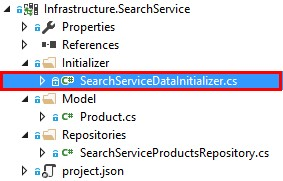
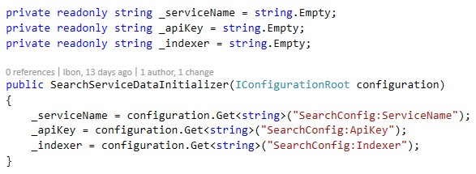
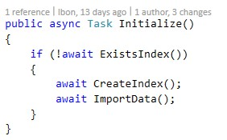
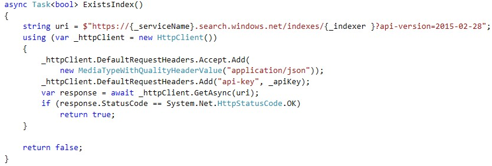
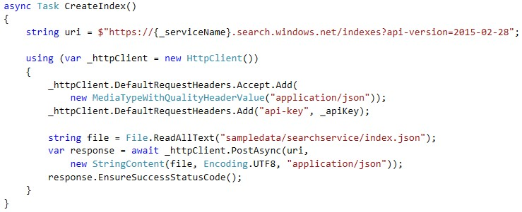
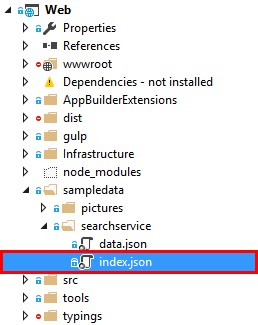
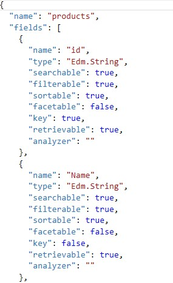
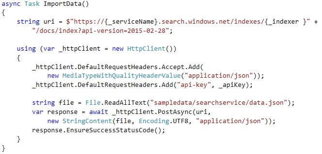
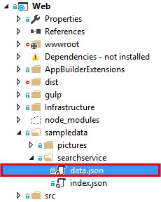
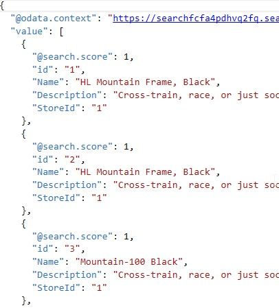

# GET STARTED WITH AZURE SEARCH

1.	Open SearchServiceDataInitializer.cs (Infra.SearchService>Initializer).	

	> Mike, a customer that is looking for a new bike, wants to search some bikes on our store, but when he tries to submit a search he sees that there are no results available. 

	> First of all, we’ll need to create the Products index and populate it with data, so our customers are allowed to search for their desired bikes. 

	> The SearchServiceDataInitializer is in charge of doing so.

	

	> In each request we’ll need to send a header with de API key, and all of them will have the service name and index name (_indexer), as they are part of the request URL.

	> All this data will be initialized when the class is instantiated, and it will be retrieved from the configuration file (appsettings.json).

	

	> The method Initiliaze is in charge of creating and populating the products index.

	> It is called when the application is executed. 

	

	> Before creating the products index, we check that it doesn’t exist yet, just making a request to the index URL. If we receive a valid response, it means the index exists.

	> We can see how the request is formed with the service name, the index name and finally adding a header with the API key.

	

	> To create the products index, we submit a request to the base url, without using the request name, because otherwise we wouldn’t receive a valid response, as the URL does not exist.

	> We need to submit a POST request to create the index. In the request’s body, we need to send the schema of the index, this means, declare all the fields with their types and attributes, as we saw in the overview, in a JSON syntax. Instead of putting in this method, we have created a separated file with this schema.

	

1.	Open index.json.

	

	> This file contains the index name, which is “products”, and the fields of this index.

	> For our application the fields will be:
	> -	Id
	> -	Name
	> -	Description
	> -	StoreId
	> -	OriginalPrice

	

	> After creating the products index, it is time to populate it with some data, because otherwise our clients wouldn’t be able to search any data.

	> Again, we have some sample data in a separated file. The request is similar to the previous one, but this time it points directly to the created index.

	

1.	Open data.json.	

	

	> As with the index.json, the data must follow a JSON syntax.

	> It is important to note that the keys match the index fields names. 

	> This file contains information about bikes that are available in our store, which we want to use to make searches based on it.

	
 
<a href="4.UpdateIndex.md">Next</a>
