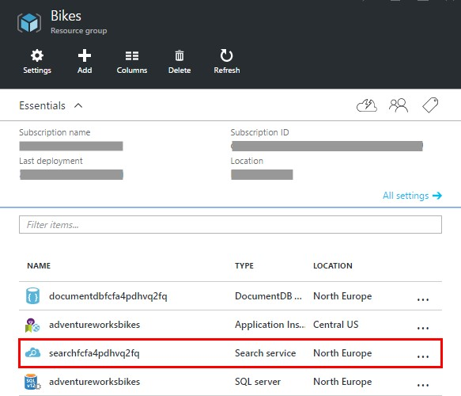
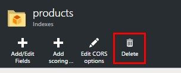
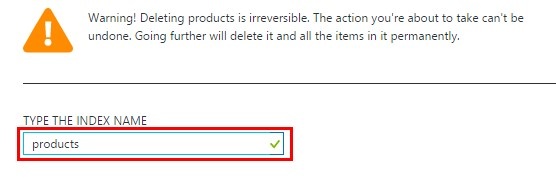
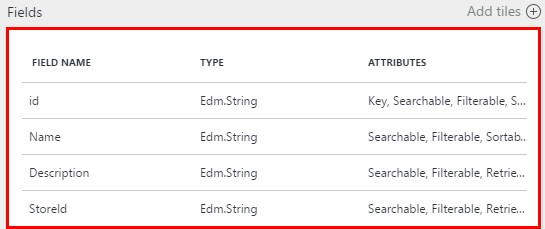

# UPDATING THE INDEX

There are some functionalities that require performing an index update. Right now it’s not possible to update existing indexes, so we have to delete the index and recreating it. In this part we explain how we can achieve this.
	
1.	Click on the Resource Group created.	

	

1.	Click on the Search Service.

		

1.	Click on Products.

	

1.	Click on Delete.	

	

1.	Confirm the action providing the index name.	

	

1.	Click on Delete.	

	

1.	Go to Visual Studio.

1.	Build the Solution.

		

	> **NOTE:** Make sure that the task “build.prod” is executed. Otherwise the index update won’t work.

	

1.	Run the application	Run the application and wait until the page is loaded. 

	> If there is any error, that means there is probably a mistake with the index.json or data.json, so make sure it is well constructed. For example, an index field with type Edm.Int32 can’t be searchable. If you set searchable true, there will be an error. 

	

1.	Go to the products index.

1.	Click on products.

	

	> Check the index is created. If so, check, the fields are correct.

2.	Click on the fields widget.

	

	> Here you can see the fields’ attributes, as well as the analyzers associated to them and the suggesters.

	
 
<a href="5.Suggestors.md">Next</a>