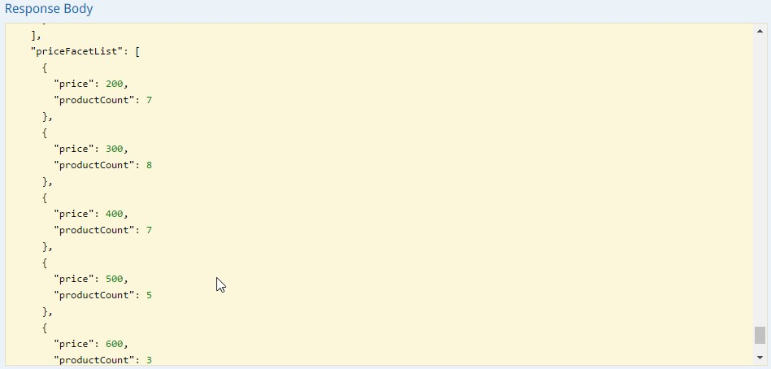
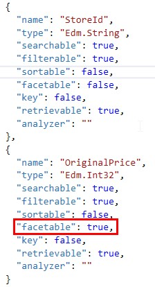
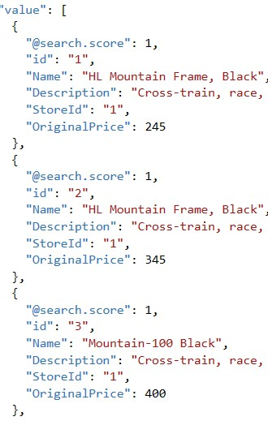
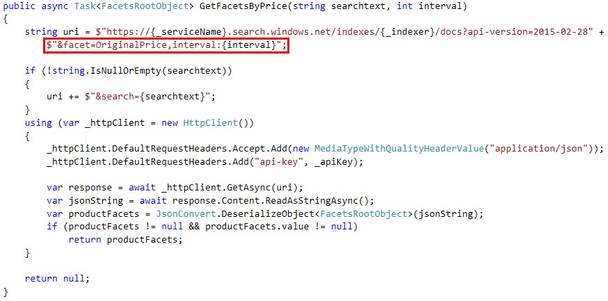

# FACETS

Faceted navigation is a filtering mechanism that provides self-directed drilldown navigation in search applications. While the term ‘faceted navigation’ might be unfamiliar, it’s almost a given that you have used one before.

Facets can help you find what you are looking for, while ensuring that you won’t get zero results. As a developer, facets let you expose the most useful search criteria for navigating your search corpus. In our application, we could use facets to let the user know how many bikes there are available in a specified range of prices.

We are going to retrieve all the bikes that the store has available, showing the number of bikes available in several price ranges, so Mike can bound his search and find those bikes with features and price that he can afford.



In the image, we can see the final result. It means the following:

There are 7 bikes between 200$ and 300$.

There are 8 bikes between 400$ and 400$.

And so on.

1.	Open index.json.	

1.	Edit the facetable field of OriginalPrice and set it to true.	

    > To make this possible, we are going to modify the index schema, because we need to create a facetable field. It will be OriginalPrice.

    

1.	Open data.json.	

    > We need to modify the sample data as well, to include the new field.

    

1.	Open SearchServiceProductsRepository. 

1.	Find the GetFacetsByPrice method.

    

1.	Copy and paste the code inside the method.

    ```csharp
        string uri = $"https://{_serviceName}.search.windows.net/indexes/{_indexer}/docs?api-version=2015-02-28" +
            $"&facet=OriginalPrice,interval:{interval}";

        if (!string.IsNullOrEmpty(searchtext))
        {
            uri += $"&search={searchtext}";
        }
        using (var _httpClient = new HttpClient())
        {
            _httpClient.DefaultRequestHeaders.Accept.Add(new MediaTypeWithQualityHeaderValue("application/json"));
            _httpClient.DefaultRequestHeaders.Add("api-key", _apiKey);

            var response = await _httpClient.GetAsync(uri);
            var jsonString = await response.Content.ReadAsStringAsync();
            var productFacets = JsonConvert.DeserializeObject<FacetsRootObject>(jsonString);
            if (productFacets != null && productFacets.value != null)
                return productFacets;
        }

        return null;
    ```	

    

    > As you probably has noticed, we have included the facet name in the request.

    > Also, as we said, we want to retrieve “buckets” of bikes, each bucket containing the number of bikes in a certain price range. We achieve this including customizing the faceting. In this case, we customize it including interval:{interval}, being {interval} the parameter received in the method.

1.	Update the index.

    > Right now it’s not possible to update existing indexes, so we have to delete the index and recreating it. In this part we explain how we can achieve this.

<a href="7.ScoringProfile.md">Next</a>  
