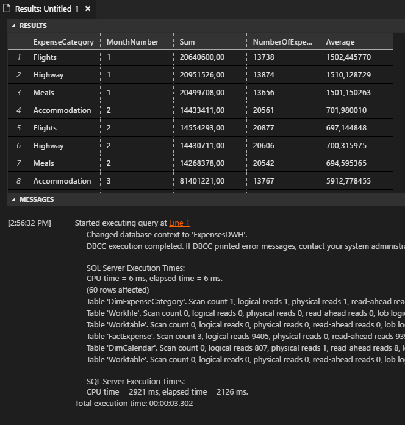
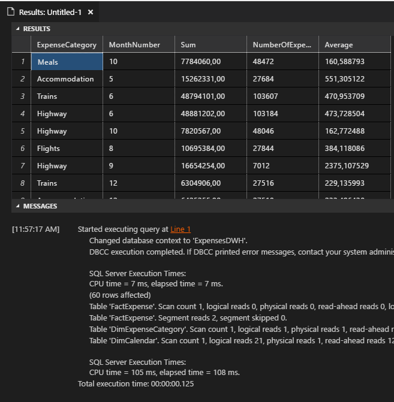

# IN-MEMORY CLUSTERED COLUMNSTORE INDEX

SQL Server 2016 introduces the ``Clustered ColumnStore index`` feature for In Memory tables, to allow users who want to analyze a huge amount of data information contained in a data warehouse system to do so with huge performance improvements. While new expenses are introduced on the website every minute, performance of the reports begins to suffer. In this hands on lab, we will use ColumnStore indexes to improve the performance and reduce the response time of the reports backed by the MyExpenses data warehouse.

A ColumnStore index is a technology for storing, retrieving, and managing data by using a columnal data format, called a ColumnStore over traditional row-oriented storage. So a columnstore stores data that is logically organized as a table with rows and columns, and physically stored in a columnar format. This gives us two significant benefits:

 - 10x Query improvements in data warehouses over row-oriented
 - 10x Data compression over the uncompressed data size (data from the same domain compresses better)

Check the following [link](https://msdn.microsoft.com/en-us/library/gg492088.aspx) for further information about In-Memory Column Store Index.

## Evaluating the current situation

In MyExpenses we have a Data Warehouse that we use with the aim of generating some important reports in SQL Server Reporting Services (SSRS). Our Data Warehouse contains two fact tables, Expenses and Purchases, as well as all the required dimension tables.

As time goes by, a lot of transactions and movements have been stored in the data warehouse fact tables. This makes it slower every day, generating a performance problem in the associated reports. Let's see what is happening when you execute a query:

1. First, open ``Visual Studio Code``. 

1. Press ``CTRL+N`` to open new document in ``VS Code``.  
    
1. Press ``CTRL-K,M`` and select ``SQL`` to convert the recently created document to SQL type.

1. Copy/Paste this SQL script:

    ```sql
    USE ExpensesDWH

    SET STATISTICS IO ON
    SET STATISTICS TIME ON
    
    DBCC DROPCLEANBUFFERS

    SELECT ec.ExpenseCategory, dc.MonthOfYear AS [MonthNumber], 
      SUM(fact.Amount) AS [Sum], 
      COUNT(*) AS NumberOfExpenses, 
      AVG(fact.Amount) AS Average
      FROM [dwh].[FactExpense] fact
          INNER JOIN [dwh].[DimCalendar] dc 
                ON fact.IdCalendar = dc.IdCalendar
          INNER JOIN [dwh].[DimExpenseCategory] ec 
                ON fact.IdExpenseCategory = ec.IdExpenseCategory
      GROUP BY ec.ExpenseCategory, dc.MonthOfYear;
    GO          
    ```
    
1. Use ``CTRL+SHIFT+E`` to execute it.

    > **TIP**  
    > Remember you can select parts of the code and execute it individually.

    You can see the query results at the top and SQL execution information at the bottom:

      

1. Let's explain the results that we've obtained:

    First of all, we see the parse and compile time. This is the time spent analyzing the SQL statement for syntax errors, breaking it into its component parts and producing the internal execution tree, plus the time spent compiling the execution.
    
    ```sql
      SQL Server Execution Times:
      CPU time = 6 ms,  elapsed time = 6 ms.
    ```
    
    > **NOTE**  
    > These values will be slightly different.

1. Then we see detailed information about the tables used by the query, as well as how many reads are necessary to perform the query. Considering this information, we can see easily that this query has performed quite a lot of index scans, many logical reads (cache reads), a few physical reads (disk read) and a huge number of read-ahead-reads.
    
    ```sql
      (60 row(s) affected)
      Table 'DimExpenseCategory'. Scan count 1, logical reads 1, physical reads 1, read-ahead reads 0, lob logical reads 0, lob physical reads 0, lob read-ahead reads 0.
      Table 'Workfile'. Scan count 0, logical reads 0, physical reads 0, read-ahead reads 0, lob logical reads 0, lob physical reads 0, lob read-ahead reads 0.
      Table 'Worktable'. Scan count 0, logical reads 0, physical reads 0, read-ahead reads 0, lob logical reads 0, lob physical reads 0, lob read-ahead reads 0.
      Table 'FactExpense'. Scan count 3, logical reads 9405, physical reads 0, read-ahead reads 9398, lob logical reads 0, lob physical reads 0, lob read-ahead reads 0.
      Table 'DimCalendar'. Scan count 0, logical reads 807, physical reads 1, read-ahead reads 8, lob logical reads 0, lob physical reads 0, lob read-ahead reads 0.
      Table 'Worktable'. Scan count 0, logical reads 0, physical reads 0, read-ahead reads 0, lob logical reads 0, lob physical reads 0, lob read-ahead reads 0.
    ```
    
1. SQL Server also provides you the total execution time, in our case 3549ms (don’t worry if your elapsed time is different, it's perfectly normal)
      
    ```sql
      SQL Server Execution Times:
      CPU time = 2921 ms,  elapsed time = 2126 ms.
    ```

    As you can see, a lot of time and I/O resources were spent in order to retrieve the required information. In the next page, we will create an in memory table with a clustered column storage index in order to analyze if this helps us solve our problem by increasing the performance.
    
1. *(Optional)* If you want to deactivate echo of Statistics execute this query:

    ```sql
    SET STATISTICS IO OFF
    SET STATISTICS TIME OFF      
    ```

## Creating a in memory columnstore index table

1. Let's begin the creation of the new In-Memory Clustered ColumnStore in our database. First we will need a memory optimized data FileGroup, where we will store our optimized data. To create it, execute the following statement:

	```sql
	ALTER DATABASE [ExpensesDWH] ADD FILEGROUP ExpensesInmemory CONTAINS MEMORY_OPTIMIZED_DATA   
	```

1. Now, let's create the memory optimized data in our new FileGroup:

	```sql
	ALTER DATABASE [ExpensesDWH] ADD FILE (name='expenses_file1', filename='c:\data_expensesdwh_file1') TO FILEGROUP ExpensesInmemory   
	ALTER DATABASE [ExpensesDWH] SET MEMORY_OPTIMIZED_ELEVATE_TO_SNAPSHOT=ON  
	```

1. Change the name to the current FactExpense table to a temporal name.

	```sql
	EXEC sp_rename '[dwh].[FactExpense]', 'FactExpenseTemp'
	```
 
1. Once we have the data in the FileGroup ready, we can create a new one in the memory table with a clustered columnstore index. It will have the same schema as the current FactExpense table, since we will replace the old one with the optimized version.

	```sql
	CREATE TABLE [dwh].[FactExpense] (  
		[IdExpense] [int] NOT NULL PRIMARY KEY NONCLUSTERED,
		[IdCalendar] [int] NOT NULL,
		[IdExpenseCategory] [smallint] NOT NULL,
		[IdCostCenter] [smallint] NOT NULL,
		[IdEmployee] [int] NOT NULL,
		[IdReport] [int] NOT NULL,
		[Amount] [decimal](10, 2) NOT NULL,
		INDEX ExpenseCCI CLUSTERED COLUMNSTORE  
	)WITH (MEMORY_OPTIMIZED = ON );
	```

	Note the inclusion of the *INDEX ExpenseCCI CLUSTERED COLUMNSTORE*, in order to define a clustered columnstore index, and the *WITH (MEMORY_OPTIMIZED = ON)* that marks the table as memory optimized.

1. Let's insert the data from the current FactExpenseTemp table into the new one. Be aware that this process may take some time.

	```sql
	INSERT INTO [dwh].[FactExpense] (IdExpense, IdCalendar, IdExpenseCategory, IdCostCenter, IdEmployee, IdReport, Amount)
	SELECT IdExpense, IdCalendar, IdExpenseCategory, IdCostCenter, IdEmployee, IdReport, Amount 
	FROM [dwh].[FactExpenseTemp]
	```

1. Once both tables have the same information, delete the temporal FactExpense.

	```sql
	DROP TABLE [dwh].[FactExpenseTemp]
	```

 Now our In-Memory table is ready, it has a columnstore index, and we can compare our previous benchmark and statistics with new ones generated against it.

## Performance in memory clustered columnstore index

Let's analyze how the performance changes with a clustered columnstore index in a memory optimized table. We will (obviously) use the same query we used at the beginning of the lab.

1. Execute our well-known query with statistics activated:  

  ```sql
    USE ExpensesDWH

    SET STATISTICS IO ON
    SET STATISTICS TIME ON
    
    DBCC DROPCLEANBUFFERS

    SELECT ec.ExpenseCategory, dc.MonthOfYear AS [MonthNumber], 
      SUM(fact.Amount) AS [Sum], 
      COUNT(*) AS NumberOfExpenses, 
      AVG(fact.Amount) AS Average
      FROM [dwh].[FactExpense] fact
          INNER JOIN [dwh].[DimCalendar] dc 
                ON fact.IdCalendar = dc.IdCalendar
          INNER JOIN [dwh].[DimExpenseCategory] ec 
                ON fact.IdExpenseCategory = ec.IdExpenseCategory
      GROUP BY ec.ExpenseCategory, dc.MonthOfYear;
    GO  
  ```

1. The set of results retrieved is the same:

    

    > **NOTE**  
    > The values on Segment reads, CPU time, etc, will be slightly different.

1. Let's check if the statistics are different:

    ```sql
    (60 row(s) affected)
    Table 'FactExpense'. Scan count 1, logical reads 0, physical reads 0, read-ahead reads 0, lob logical reads 0, lob physical reads 0, lob read-ahead reads 0.
    Table 'FactExpense'. Segment reads 2, segment skipped 0.
    Table 'DimExpenseCategory'. Scan count 1, logical reads 1, physical reads 1, read-ahead reads 0, lob logical reads 0, lob physical reads 0, lob read-ahead reads 0.
    Table 'DimCalendar'. Scan count 1, logical reads 21, physical reads 1, read-ahead reads 12, lob logical reads 0, lob physical reads 0, lob read-ahead reads 0.

    SQL Server Execution Times:
      CPU time = 105 ms,  elapsed time = 108 ms.
    ```

1. If we compare the before / after execution times:

  ```sql
  --BEFORE
    SQL Server Execution Times:
      CPU time = 2921 ms,  elapsed time = 2126 ms.

  --AFTER
    SQL Server Execution Times:
      CPU time = 105 ms,  elapsed time = 108 ms.
  ```

  **Wait for it**... 20 times faster! Impressive, isn't it? 

  Another thing to take into account is that we have reduced the I/O dramatically. Let's have a detailed look at the statistics.

  ```sql
  --BEFORE  
  Table 'FactExpense'. Scan count 3, logical reads 9405, physical reads 0, read-ahead reads 9398, lob logical reads 0, lob physical reads 0, lob read-ahead reads 0.

  --AFTER
  Table 'FactExpense'. Scan count 1, logical reads 0, physical reads 0, read-ahead reads 0, lob logical reads 0, lob physical reads 0, lob read-ahead reads 0.
  Table 'FactExpense'. Segment reads 2, segment skipped 0.
  ```

<a href="conclusion.md">Next</a>