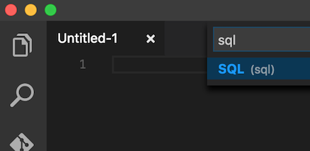
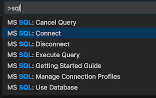
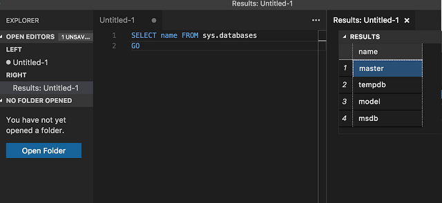

# CONNECT TO ``SQL Server 2016 on Linux``

To connect to our SQL Server 2016 on Linux running on docker container we can use any of the
connection tools available but in this labs we are going to connect with ``VS Code``
(Visual Studio Code) and the ``mssql`` extension. 

## Install mssql extension

1. Open ``Visual Studio Code``

1. Press **COMMAND+SHIFT+P** (or **F1**) to open the Command Palette in VS Code.

1. Select ``Install Extension`` and type ``mssql``.  

    > You have complete instructions on the [mscode extension](https://docs.microsoft.com/en-us/sql/linux/sql-server-linux-develop-use-vscode)
    web page.

1. Click on install ``mssql``.  

    

1. The ``mssql`` extension takes up to one minute to install.   

1. Wait for the prompt that tells you it successfully installed and restart VS Code.

## Connect to SQL Server 2016 on Linux

1. In ``VS Code``, Press **COMMAND+N** to open a new ``Plain Text`` file type by default.

1. Press **COMMAND+K,M** and change the language mode to **SQL**.  

    

1. Select **SQL** file type. 

    > Now you have all ``mssql`` extension functionalities available  

1. In ``VS Code``, press **COMMAND+SHIFT+P** (or **F1**) to open the Command Palette.

1. Type **sql** to display the ``mssql`` commands.  

    

1. Select the **MS SQL: Connect** command. You can simply type **sqlcon** and press **ENTER**.

1. Select **Create Connection Profile**.  

    > This creates a connection profile for your SQL Server 2016 on Linux.

1. Follow the prompts to specify the connection properties for the new connection profile.  

1. After specifying each value, press **ENTER** to continue.    

    If you have followed these lab instructions, then this is your connection data:

    > | Data | Value | Observations |
    > |------|-------|--------------|
    > | Server Name | **localhost,11433** | _Remember to separate host name and port with comma_ |
    > | Database name |  | _Leave this empty_ |
    > | User name | **sa** | |
    > | Password |**P2ssw0rd** | |
    > | Save Password? | **Yes** | _If you choose **No** you will be prompted for it every time_ |
    > | Enter a name for this Profile | **localhost-docker** | _If you want to save this profile with a name, enter it here_ |

    We will name this connection: **``localhost-docker``**

    > **Tip**
    > You can create and edit connection profiles in the User Settings file (settings.json).  
    > Open the settings file by selecting **Preference** and then **User Settings** in the VS Code menu.  
    >  
    > For more details, see [manage connection profiles](https://github.com/Microsoft/vscode-mssql/wiki/manage-connection-profiles).

1. In your ``VS Code`` type this.

    ```sql 
        SELECT name FROM sys.databases  
        GO
    ```
    
1. Press **COMMAND+SHIFT+E** to run the query and list the existing databases in your SQL Server instance

    

    > **NOTE**: Your databases could be a bit different compared to the databases included in the picture.

<a href="3.DynamicDataMasking.md">Next</a>