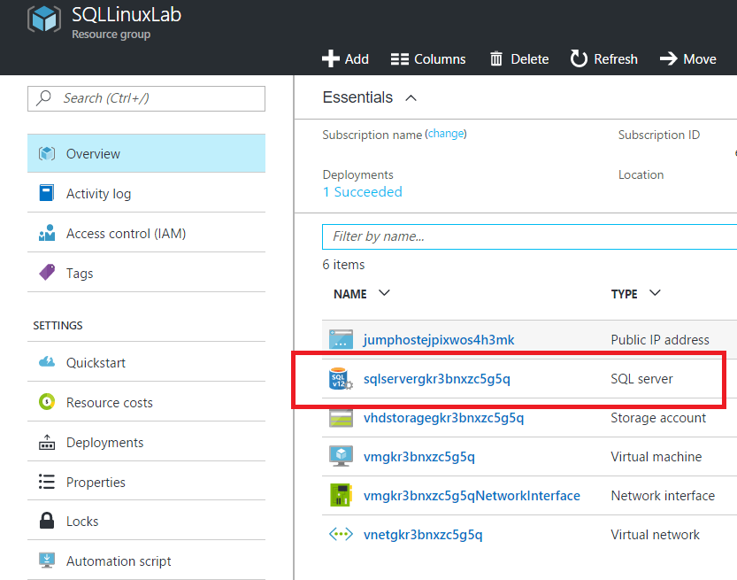

# USE YOUR ``SQL Server 2016`` WHERE YOU WANT

Now with ``SQL Server 2016`` the platform is not relevant, you can use it where you want.

Locally installed on every platform you want, living inside a container as explained
in this lab or living in the cloud with Azure.

In this lab, we are going to populate and connect our application with an SQL Server
database _living_ on Azure and you can see as our application does not feel any different
with our ``SQL Server 2016 on Linux`` running inside a Docker container.

# Check the existing SQL Server on Azure

1.	Open the [Azure portal] (https://portal.azure.com)

1.	Click on resource groups and click on the existing resource group.

1.	You already have an SQL Server ready to be used in this lab.

    - **Host:** YOUR_AZURE_SQL_SERVER 
    - **UserName:**  devimmersion
    - **Password:** P2ssw0rd@Dev

    

<a href="1.PopulateAzureDatabase.md">Next</a>

    
