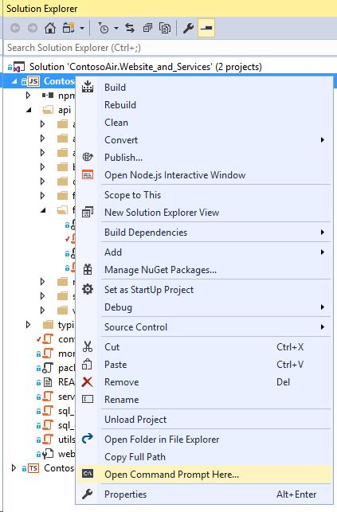
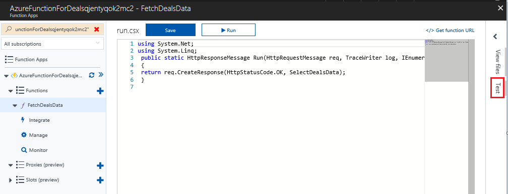

<page title="Globally distributed application for experiencing low latency"/>

## Scenario 1: Globally distributed application for experiencing low latency


### Part A - Accessing the Azure Portal

  > _We'll start with accessing_ **Azure Portal.** _For creating resources, you need to_ **Sign in** _to_ **Azure Portal** _. The steps to do the same are given below:_

1. Click on the link [Azure Portal](http://portal.azure.com) to open **Azure Portal** and maximize the browser window.
1. Sign in with your **Azure username** and **password**:
    - Username: **<inject key="AzureAdUserEmail" />**
    - Password: **<inject key="AzureAdUserPassword" />**
1. Click on **Sign in** button. 
1. You may encounter a popup entitled **Welcome to Microsoft Azure** with options to **Start Tour** and **Maybe Later** Choose **Maybe Later**. [Ignore the Step no. 4 if didn't get the popup message]

   > _Great! You are now logged in to the Azure Portal._

### Part B - Deployment of Resources Through Ansible Playbooks

   > _Here first of all we will see how we can deploy resources such as Azure Cosmos DB Account through Ansible Playbooks._

1. Launch **Bash on Ubuntu on Windows**. Click on **Ubuntu bash Icon** . Bash shell will be launched. 
1. Follow the given steps to install **Ubuntu on Windows**. Press **y** to continue. This process may take some time.

1. After completion of process close the **Ubuntu bash** and relaunch **Bash on Ubuntu on Windows** by clicking on **Ubuntu bash Icon** . And then continue with the given steps.
   > **Note:** It will ask to create **username and password**, ignore it and close the bash. As in our case we need to execute all the commands with root user only. And then again relaunch the bash from desktop.

1. Execute the following commands in bash shell to install **Ansible** and then execute the playbook.
   ```cmd
   apt-get update && apt-get install -y libssl-dev libffi-dev python-dev python-pip
   ```
   ```cmd
   pip install ansible[azure]
   ```  
   > **Note:** This will take some time to install packages of Ansible in bash.
1. Create a folder where you will save and execute your **Ansible Playbook**. Follow given steps for the same. 
1. Execute the command given below to create a folder and then navigate to the same folder.
   ```cmd
   mkdir ansible
   ```
   > **Note:** Command to create the folder.

   ```cmd
   cd ansible
   ```
   > **Note:** Command to navigate to the same folder.

   ```cmd
   vi ansible_playbook.yml
   ```
   > **Note:** Command to open **vi editor** and create **.yml** file.

1. Press **I** button from keyboard to enable **insert** mode in **vi editor**. 
   
1. Copy the **yml** content given below.
   
   ```yml
   - hosts: localhost
     vars:
         ad_user: ad_user_id
         password: "your_password"
         subscription_id: your_subscription_id
     tasks:
       - name: Get facts for one resource group
         azure_rm_resourcegroup_facts:
             ad_user: '{{ ad_user }}'
             password: '{{ password }}'
             subscription_id: '{{ subscription_id }}'
         register: result

       - debug:
           var: result

       - name: Create Azure Deploy
         azure_rm_deployment:
             ad_user: '{{ ad_user }}'
             password: '{{ password }}'
             subscription_id: '{{ subscription_id }}'
             #state: present
             template_link: 'https://raw.githubusercontent.com/Click2Cloud/developer-immersion-data/master/labs/sp-gda/gdaexpericence1/story_a_gda_using_cosmosdb/devops/template.json'
             parameters_link: 'https://raw.githubusercontent.com/Click2Cloud/developer-immersion-data/master/labs/sp-gda/gdaexpericence1/story_a_gda_using_cosmosdb/devops/parameters.json'
             resource_group_name: '{{ result.ansible_facts.azure_resourcegroups[0].name }}'
             location: "southcentralus"                                                                                                                                                                                                  
   ```

1. Now, move to **Ubuntu bash** and Ensure the **vi editor** is in insert mode and paste the content copied in **step 5** in **ansible_playbook.yml** file which was already opened in **step 3** by a single right click.
1. Add **Username** and **Password** given below against respective keys in the same **.yml** file.
   ```js
     vars:
          ad_user: Your_user_Id
          password: Your_Password
          subscription_id: Your_subscription_Id
   ```
   - ad_user: **<inject key="AzureAdUserEmail" />**
   
   - password: **<inject key="AzureAdUserPassword" />**

   - subscription_id: **<inject story-id="story://Content-Private/content/dfd/SP-GDA/gdaexpericence1/story_a_gda_using_cosmosdb" key="subscriptionId"/>**

1. Press **Esc key + : + wq** to save and exit the file in vi editor.
1. Once the playbook file is saved execute the given command to run the **Ansible playbook**.
   ```cmd
   ansible-playbook ansible_playbook.yml
   ```    
1. Now go to **Azure Portal** click on **Resource groups** named **<inject story-id="story://Content-Private/content/dfd/SP-GDA/gdaexpericence1/story_a_gda_using_cosmosdb" key="myResourceGroupName"/>** option present in the favourites panel. Resource group with all the resources which were deployed through **Ansible playbook** will appear.
   > Great! Just now you learnt how to deploy resources through Ansible playbooks. it may take some time to successfully execute Ansible Playbook.

### Part C - Setting variables in configuration file

   > _In this part, you will come across how to configure variables in config.js file._

   > **NOTE:**
   > - For this Scenario, we have already created **Azure Cosmos DB Account** in **South Central US**. Cosmos DB Account **<inject story-id="story://Content-Private/content/dfd/SP-GDA/gdaexpericence1/story_a_gda_using_cosmosdb" key="cosmosDBWithSQLDBName"/>**  
   is deployed in **South Central US** region under **Resource group <inject story-id="story://Content-Private/content/dfd/SP-GDA/gdaexpericence1/story_a_gda_using_cosmosdb" key="myResourceGroupName"/>**

1. To download the ContosoAir app source code launch the **Command Prompt** and run below commands
   ```cmd
   git clone https://github.com/Click2Cloud/gdaexperience1-story-a c:\source\experience1
   ```
2. Now goto **c:\source\experience1** folder through **File Explorer** present on the task bar  and double click on **ContosoAir.Website_and_Services.sln** file to load the project into **Visual Studio 2017** IDE.  This may take some time.
1. If prompted to sign in to **Visual Studio**, click **Sign in**
1. In the **Email or phone** field, type <inject key="AzureAdUserEmail"/>
1. In the **Password field**, type <inject key="AzureAdUserPassword"/>
1. Click **Sign in**
1. If prompted with the Choose your **color theme screen**, select a color theme.
1. Click **Start Visual Studio**.
1. Go to the **Visual Studio 2017** IDE and click on **ContosoAir.Services** project and double click on **config.js** file to open.

   

1. Navigate to **Azure Portal's Resource groups** option present in the favourites menu on the left side panel and select the resource group **<inject story-id="story://Content-Private/content/dfd/SP-GDA/gdaexpericence1/story_a_gda_using_cosmosdb" key="myResourceGroupName"/>** and click on **Azure Cosmos DB Account** **"<inject story-id="story://Content-Private/content/dfd/SP-GDA/gdaexpericence1/story_a_gda_using_cosmosdb" key="cosmosDBWithSQLDBName"/>"**.
1. Click on **Keys** option present under **Cosmos DB Account** blade, and copy **URI, Primary key** and **Cosmos DB Account** name i.e. **<inject story-id="story://Content-Private/content/dfd/SP-GDA/gdaexpericence1/story_a_gda_using_cosmosdb" key="cosmosDBWithSQLDBName"/>** and paste in **config.js** file opened in **Visual Studio 2017** IDE.

   

1. Go to **Visual Studio 2017** IDE and paste the **URI, PRIMARY KEY, Azure Cosmos DB account Name** into **config.js** file present under "**ContosoAir.Services"** project.

   > DOCUMENT_DB_ENDPOINT:         'Your Cosmos DB Endpoint URI',
   > DOCUMENT_DB_PRIMARYKEY:       'Your Primary Key', 
   > DOCUMENT_DB_DATABASE:         '<inject story-id="story://Content-Private/content/dfd/SP-GDA/gdaexpericence1/story_a_gda_using_cosmosdb" key="cosmosDBWithSQLDBName"/>',

   

1. You may change the values of parameters **DOCUMENT\_DB\_FLIGHT, DOCUMENT\_DB\_SEAT, DOCUMENT\_DB\_BOOKING, DOCUMENT\_DB\_DEALS, DOCUMENT\_DB\_PREFERRED\_REGION** and save the file. It will create the collection in **Cosmos DB** with these names.
   > You can keep the default collection names for **DOCUMENT\_DB\_FLIGHT, DOCUMENT\_DB\_SEAT, DOCUMENT\_DB\_BOOKING, DOCUMENT\_DB\_DEALS** parameters **.**
1. Navigate to **Azure Portal's** **Resource groups** option present in the favourites menu on the left side panel and select the resource group **"<inject story-id="story://Content-Private/content/dfd/SP-GDA/gdaexpericence1/story_a_gda_using_cosmosdb" key="myResourceGroupName"/>"** and click on **Azure Cosmos DB Account** **<inject story-id="story://Content-Private/content/dfd/SP-GDA/gdaexpericence1/story_a_gda_using_cosmosdb" key="cosmosDBWithSQLDBName"/>** then, click on **Replicate data globally** option present under **Cosmos DB Account** blade.
1. Copy the **write region** and paste it against **DOCUMENT\_DB\_PREFERRED\_REGION** key in **config.js file** which is already opened in **Visual Studio 2017** IDE and save this file.

   > **NOTE:** When you set the region name in **DOCUMENT\_DB\_PREFERRED\_REGION** key it will use the same region for all the database operations such as writing and reading data from database in ContosoAir application **.**

   > DOCUMENT_DB_FLIGHT:           'FlightsCollection',
    DOCUMENT_DB_SEAT:              'SeatsCollection',
    DOCUMENT_DB_DEAL:              'DealsCollection',
    DOCUMENT_DB_BOOKING:           'BookingsCollection',
    DOCUMENT_DB_PREFERRED_REGION:  'Write_region',                        

   

1. Go to **Solution Explorer** window, right click on "**ContosoAir.Services"** project and click on **Open Command prompt Here...** option and command prompt instance will be opened.

   

1. Now execute the following commands one by one in command prompt and press enter.
   ```cmd
   npm install
   ```
   ```
   node sql_db_flightinsert.js
   ```  
   ```
   node sql_db_insert.js
   ```

1. This will create the collection with the names as mentioned in **Step 6** with sample data.
1. Switch to **Azure Portal** as launched in **Part A**, navigate to **Resource groups** option present in the favourites menu on the left side panel and select the resource group **<inject story-id="story://Content-Private/content/dfd/SP-GDA/gdaexpericence1/story_a_gda_using_cosmosdb" key="myResourceGroupName"/>** and click on **Azure Cosmos DB Account** **<inject story-id="story://Content-Private/content/dfd/SP-GDA/gdaexpericence1/story_a_gda_using_cosmosdb" key="cosmosDBWithSQLDBName"/>**.
1. Click on **Data Explorer** option it will display the collection created in **Azure Cosmos DB Account** from **Step 8**.

   

   > _Great Job!! Here you have successfully imported data into Cosmos DB._

### Part D - Creating Azure Functions

  > _Let's create a Function to retrieve data of flight deals._

1. Go to **Resource groups** option 
   present in the favourites menu on the left side panel and select the resource group **<inject story-id="story://Content-Private/content/dfd/SP-GDA/gdaexpericence1/story_a_gda_using_cosmosdb" key="myResourceGroupName"/>** and click on
    **Azure Function** <inject story-id="story://Content-Private/content/dfd/SP-GDA/gdaexpericence1/story_a_gda_using_cosmosdb" key="azureFunctionName"/> .
 
1. Click on **+ sign**  besides **Functions <inject story-id="story://Content-Private/content/dfd/SP-GDA/gdaexpericence1/story_a_gda_using_cosmosdb" key="azureFunctionName"/>.**

   

1. Click on link **Custom function** present at the bottom of the page.
1. Click on **HttpTrigger C#** template to select it and name the function as "**FetchDealsData**" in **Name your function** textbox and click **Create** button. 
1. A function with sample default code would get created. Now, replace the **sample default code** with the code snippet given below.

    ```c#
    using System.Net;
    using System.Linq;

    public static HttpResponseMessage Run(HttpRequestMessage req, TraceWriter log, IEnumerable<dynamic> SelectDealsData)
    {
    return req.CreateResponse(HttpStatusCode.OK, SelectDealsData);
    }

    ```

    > **NOTE:**
    > In above code snippet, **IEnumerable<dynamic> SelectDealsData** is a parameter to fetch the list of DealsData collection type data from **Cosmos DB**. This method returns the result fetched from **Cosmos DB** and **HttpStatusCode** using **CreateResponse** method with the help of **HttpRequestMessage req**.

1. Click on **Save** button. Now, click on **"FetchDealsData"** function. Then click on **Integrate** option given in the **Function Apps** blade.

   

1. Go to **Inputs,** and click on  then select **Azure Cosmos DB** and click **Select** button.
1. Enter **Document parameter name** as **"SelectDealsData"** in text box, **Database name** as **<inject story-id="story://Content-Private/content/dfd/SP-GDA/gdaexpericence1/story_a_gda_using_cosmosdb" key="cosmosDBWithSQLDBName"/>** and Collection name as **"DealsCollection"** in respective textboxes.
1. Copy the **SQL query** given below and paste it in **SQL Query (optional)** text box.

    ```sql
   select c.id, c.fromName, c.fromCode, c.toName, c.toCode, c.price, c.departTime, c.arrivalTime, c.hours, c.stops, c.since from c
    ```

    > **NOTE:** Above **SQL query** is responsible to get deals details from **DealsCollection** in **Cosmos DB** like id, from name, from code, to name, to code, price, depart time, arrival time, hours, stops, since. (Ignore non-mandatory fields)

    

1. To enter **Cosmos DB account connection,** click on **new** link given beside **Cosmos DB account connection** textbox.
1. You will be redirected to **Document DB Account blade** , select the **Document DB Account** named as **<inject story-id="story://Content-Private/content/dfd/SP-GDA/gdaexpericence1/story_a_gda_using_cosmosdb" key="cosmosDBWithSQLDBName"/>**.
1. Then click **Save** button  and close the window by clicking on **cancel**  button.
1. To check whether the function is integrated, click on **FetchDealsData** function present under **AureFunctionForDeals** function app blade then click on **Test** option present at the right most corner.

   

1. Select **HTTP method** as **GET** from the dropdown. Then click **Run** button  at the bottom.
1. Status **200 Ok** will be displayed once the test is completed which signifies that the function is integrated successfully.

   

   > _Here you go! You have successfully created Azure Function to_ _retrieve flight deals_ _data from_ **Cosmos DB** _._

1. Click on function named "**FetchDealsData".**
1. You will get navigated to function and will find **</> Get function URL** link on the top right corner of the page. Click on the link 
1. On clicking **</> Get function URL,** you will get a pop up window with a URL.

    
1. Click on  icon to copy the given URL and paste it against **config variable** AZURE\_FUNCTION\_DEALS\_URL: 'Get function URL', in **config.js file** opened in **Visual Studio 2017** IDE and save the file.

   > _Awesome, you have created Azure Function for Deals data._

### Part E Launching ContosoAir Website and Services

   > _In this part, you will come across how to enable the services and launch_ **ContosoAir website** _._

1. Go to **Command Prompt** which was already launched in **Step 16 of Scenario 1, Part B.** and type command **npm start** to start the service.
   ```cmd
   npm start
   ```

   

2. You may encounter a popup for **Windows Firewall ...**. Click on cancel button to close the pop up.
1. Go to **Solution Explorer** window, right click on "**ContosoAir.Website"** project and click on **Open Command Prompt Here...** option and command prompt instance will be opened.

   

1. Now execute the following commands one by one in command prompt and press enter.
    ```cmd
   npm install -g @angular/cli
    ```
    ```
   npm install 
    ```
    ```
   set PATH=%PATH%;%AppData%\npm\
   ```
     > **Note:** To install angular and all the required packages.

1. Once the above process is completed. Type command **ng serve**.
    ```cmd
   ng serve
    ```
    > **Note:** This process may take some time.

    

1. Copy the **localhost URL** [http://localhost:4200](http://localhost:4200) from the **Command Prompt** and paste it in **Microsoft Edge** browser and press enter.

   

   > **Note:** You should have **Microsoft** **Account** **Credentials** to Login and get access to **ContosoAir** website.

   

1. Once you get Logged-In you will be redirected to **ContosoAir** Website **.** Enter **Departure date** and **Return date** in **YYYY-MM-DD** format and click **Find Flights** button.

   > **Note:** If the browser refresh continously then please open the **localhost URL** [http://localhost:4200](http://localhost:4200) in different browser i.e. **Edge browser** 
   > 
  

1. It will show the time required to retrieve the flights data from **South Central US** region at the **top of the webpage.**
1. The time showing in the milliseconds would be showing High Latency or Low Latency it depends on your current region.
   
   > **NOTE:**
   > **Suppose your current region is South Central US and the database is also present in South Central US region then it will give you Low Latency, but for the region which is far away from your current region you will face High Latency.**
   > **The concept of**  **high**  **latency will be better understood if your current location is far away from the region where your database is located.**


### Part F Global Database Replication

   > Replication protects your data and preserves your application up-time in the event of transient hardware failures. If your data is replicated to a second data centre, it's protected from a catastrophic failure in the primary location.

   > Replication ensures that your storage account meets the  [Service-Level Agreement (SLA) for Storage](https://azure.microsoft.com/support/legal/sla/storage) even in the face of failures. See the SLA for information about Azure Storage guarantees for durability and availability.

   > _To test the above scenario of_ **Part D** _lets replicate the database into multiple regions below is the procedure for the same._

   > **NOTE:** **Cosmos DB Account** named as " **<inject story-id="story://Content-Private/content/dfd/SP-GDA/gdaexpericence1/story_a_gda_using_cosmosdb" key="cosmosDBWithSQLDBName"/>"** _is already present in the_ **Resource group** _named_ **<inject story-id="story://Content-Private/content/dfd/SP-GDA/gdaexpericence1/story_a_gda_using_cosmosdb" key="myResourceGroupName"/>** _which is present in_ **South Central US.**

1. Go to **Resource groups** option  present in the favourites menu on the left side panel and select the resource group **<inject story-id="story://Content-Private/content/dfd/SP-GDA/gdaexpericence1/story_a_gda_using_cosmosdb" key="myResourceGroupName"/>**.
1. Click on **Cosmos DB Account** named **<inject story-id="story://Content-Private/content/dfd/SP-GDA/gdaexpericence1/story_a_gda_using_cosmosdb" key="cosmosDBWithSQLDBName"/>**
1. Click on **Replicate data globally** option present under **Cosmos DB Account** blade.

   

1. Select the **region** or **multiple** regions in which you want to **replicate** the database by clicking on hexagon icon.

   > **For experiencing the Latency difference replicate Azure Cosmos DB;**
   > - **Near to your current location (Low Latency).**
   > - **Far away from your current location (High Latency).**

   > **For e.g.** Select region which is near to your current region i.e. **Japan East and Australia Southeast** to replicate the database.

1. Click **Save** button. To view the deployment process, click **Notification Icon**.

   > **Note** :
   > - It takes some time near about 8 to 10 mins to complete the deployment of the resources till then let's take you to the concept of Multi-homing API's.

   > - You can distribute your data to any number of Azure regions, with the click of a button. This enables you to put your data where your users are, ensuring the lowest possible latency to your customers.

   > - Using Azure Cosmos DB's multi-homing APIs, the app always knows where the nearest region is and sends requests to the nearest data centre. All of this is possible with no config changes. You set your write-region and as many read-regions as you want, and the rest is handled for you for more details click on given link [https://docs.microsoft.com/en-us/azure/cosmos-db/introduction](https://docs.microsoft.com/en-us/azure/cosmos-db/introduction)

1. Click on **Go to resource group** button to view the successfully created resource group.
1. Click on    to close the **notification** window.

   **OR**

1. You can go to **Resource groups** option present in the favourites menu on the left side panel and click on it to check the status of the created **replicated Cosmos DB.**
1. Once the replication process is completed, again switchto **Visual studio 2017** IDE and open **Config.js** file present under project " **ContosoAir.Services"** from the **Solution Explorer** window **.**
1. Now change **DOCUMENT_DB_PREFERRED_REGION**  **'Name of the region where you replicated the database i.e. Read region'** and save the file.

   > For e.g. **Central India.**

   

1. Go to **Command Prompt** which was already launched in **Step 1** of **Part D**. Stop the services by typing **CTRL+C,** command this will terminate the process. Again, execute the command given below.

   ```cmd
   npm start
   ```
   > **Note:** We are doing this step so that all the changes done in the service will gets reflected.

   

1. Go to browser where you have launched **ContosoAir Website** and refresh the page and enter **Departure date** and **Return date** in **YYYY-MM-DD** format and click **Find Flights** button.
1. Now, you will observe that after replication to the region near your current region it will take **less time to retrieve flight data**. It will show the time required to fetch data on website on the top of page ( **Low latency** ).

   > _Remember you created Azure Function in Part C, now let's check how the Flight deals data is reflected in ContosoAir Website._
   

   > _Awesome! In this scenario, you came across Turnkey global distribution and_ **Low Latency** _feature of_ **Azure Cosmos DB.**