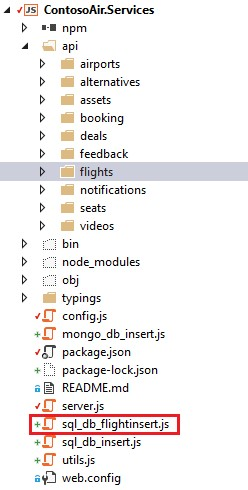
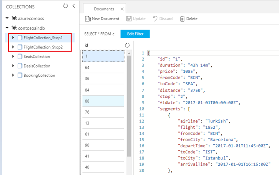
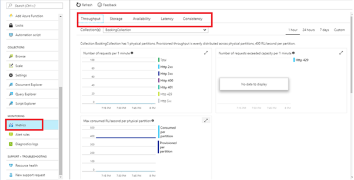
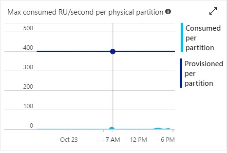
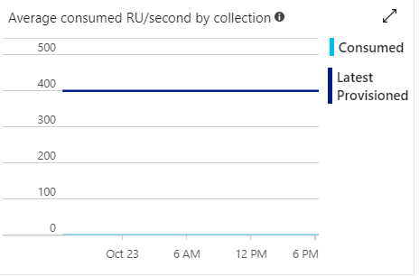
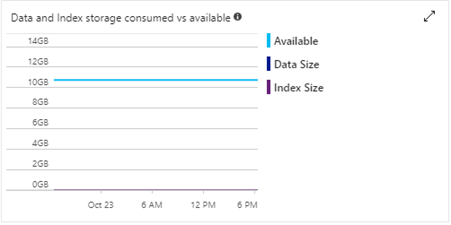
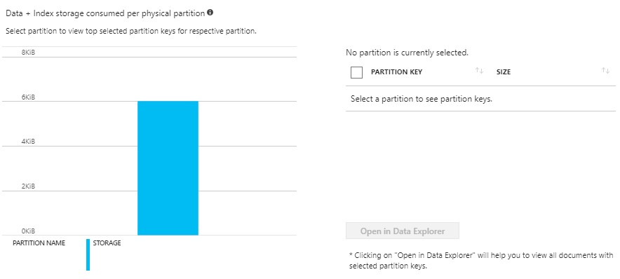
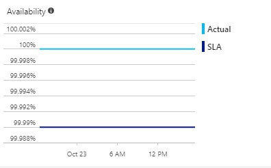
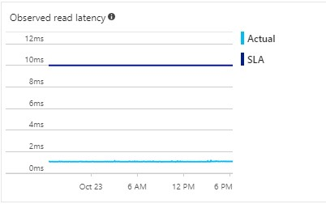
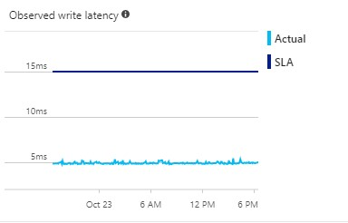

<page title="Partitioning"/>


## Scenario 4: Partitioning

### Part A - Concept of Logical Partitioning

1. In **Azure Cosmos DB**, you can store and query schema-less data with order-of-millisecond response times at any scale.
2. **Azure Cosmos DB** provides **containers** for storing data called  **collection.** **Containers** are **logical resources** and can span one or more physical partitions or **servers**.
3. The number of partitions is determined by Azure Cosmos DB based on the **storage** **size** and the provisioned **throughput** of the container.
4. Partition management is fully managed by **Azure Cosmos DB** , and you don't have to write complex code or manage your partitions. **Azure Cosmos DB** containers are unlimited in terms of **storage** and **throughput.**
5. When you create a collection, you can specify a  **partition key** property. This is the JSON property (or path) within your documents that can be used by **SQL API** to distribute data among multiple partitions.
6. **SQL API** will hash the partition key value and use the hashed result to determine the partition in which the **JSON** document will be stored. All documents with the **same partition key** will be stored in the same partition.

   >_In_ **Azure Cosmos DB,** **logical partitioning** _gets created based on the_ **size** _of the collection i.e. more than_ **10 GB** _or the specified_ **throughput of the container** _i.e.__throughput in terms of _ [_request units_](https://docs.microsoft.com/en-us/azure/cosmos-db/request-units)_ (RU) per second._

   >_Physical partitioning_**Partitioning** _is completely managed by_ **Azure** _. It will automatically create a_ **Logical Partition** _based on the_ **Partition key**. But in this case just to show you the power of **Partitioning** feature of Azure Cosmos DB we have created **Physical partition.** 

7. Data collection on which partitioning is to be performed is already imported in previous steps in **Scenario 1 Part B** in **Step no. 6**.
8. Here we had split the collection into two collections based on the partition key.
9. To verify the collection created in the database, navigate to **Azure Portal's Resource groups** option present in the favourites menu on the left side panel and select the resource group **<inject story-id="story://Content-Private/content/dfd/SP-GDA/gdaexpericence1/story_a_gda_using_cosmosdb" key="myResourceGroupName"/>** and click on **Azure Cosmos DB Account** **"<inject story-id="story://Content-Private/content/dfd/SP-GDA/gdaexpericence1/story_a_gda_using_cosmosdb" key="cosmosDBWithSQLDBName"/>"**.
10. Go to **Data Explorer** menu present under **Cosmos DB Account** blade to check the collections inserted named **FlightCollection\_Stop1** and **FlightCollection\_Stop2.**
11. Double click on file **sql\_db\_flightinsert.js** present under **ContosoAir.Services** project in **Solution Explorer** window in **Visual Studio 2017** IDE to open it.

   

   >_Below is the code snippet for the same. In this code snippet, you will see how we can split the data into two collections based on the partition key. Selection of partition key is important task as based on that your collection divides into partitions._

   > **You can also open the same code snippet inside visual studio by going to Services Project and then open sql_db_flightinsert.js and inside that go to line no. 34**

   ```js

    function createFlightsCollection(databaseLink, callback) {

        //create two collections to partition data across

        var collectionIds = [config.DOCUMENT\_DB\_FLIGHT + '\_Stop1', config.DOCUMENT\_DB\_FLIGHT + '\_Stop2'];

        getOrCreateCollections(collectionIds, function (colls) {

            var coll1Link = databaseLink + '/colls/' + colls[0];

            var coll2Link = databaseLink + '/colls/' + colls[1];

            //register these two collections with a HashPartitionResolver

            //the first paramter is the partitionkey resolver

            //  - the partitionkey resolver is a function that you provide that returns a string from your document.

            //  - if the partitionkey is a root level property such as id, then you can just hardcode the partitionkey resolver to the string literal 'id'

            //the second parameter of a HashPartitionResolver is an array of collection links

            //for this example, we are using the stop property and therefore have a custom function to return this

            //if you want to change partition key like fromCode, which is a also a string, then function (doc) {return doc.fromCode } would be used.


            var resolver = new HashPartitionResolver(function (doc) { return doc.stop; }, [coll1Link, coll2Link]);


            client.partitionResolvers[databaseLink] = resolver;

    //now let's create some documents

            insertDocuments(documentDefinitions('Flight'), function (docs) {

                callback(true);

            });

        });

    }

   ```
   >**Note** : This code creates two **physical partitions** called **FlightData\_Stop1** and **FlightData\_Stop2** based on the **partition key**.

   

12. In this case the **Stop** field is set as **partition key**.

   >Now, you will see the code snippet to retrieve the data from both the collections which was created using partition key. Below is the code snippet for the same.

   > **You can also open the same code snippet inside visual studio by going to Services Project and open api folder and then open flights folder and then open flights.controller.js and inside that go to line no. 44**

   ```js

    // Get flight data from SQLDB API

    let get = (req, res) =&gt; {

    //Provide Collection names to query data which you had already created at the time of importing a data.

        var databaseLink = 'dbs/' + config.DOCUMENT\_DB\_DATABASE;

        var coll1Link = databaseLink + '/colls/' + config.DOCUMENT\_DB\_FLIGHT + '\_Stop1';

        var coll2Link = databaseLink + '/colls/' + config.DOCUMENT\_DB\_FLIGHT + '\_Stop2';

        // Register this resolver on the instance of DocumentClient we're using

        // the key is something you can identify the resolver with. in most cases we just         use the database link

        var resolver = new HashPartitionResolver(function (doc) { return doc.stop; }, [coll1Link, coll2Link]);

        client.partitionResolvers[databaseLink] = resolver;

        let resultString = new Array();

        var end\_time;

        var start\_time = (new Date).getTime();

        // write a select query

        let querySpec = {

            query: 'SELECT \* From c'

        }

        // Fetch the data from the SQL DB Collection according to the query

        client.queryDocuments(

            databaseLink, querySpec

        ).toArray((err, results) =&gt; {

            if (!err) {

                end\_time = (new Date).getTime();

                for (var queryResult of results) {

                    resultString.push(queryResult);

                }

                // Calculate time required to fetch data from Azure CosmosDB

                var time\_slice = end\_time.valueOf() - start\_time.valueOf();

                var flight\_json = resultString;

                flight\_json.push('time\_Duration: ' + time\_slice);

                flight\_json.push('preferred\_Regin: ' + config.DOCUMENT\_DB\_REGION);

                res.send(resultString);

            }

            else { res.send(err) }

        });

    };

   ```
   > **Note:** Selection of appropriate Partitioning key is important, as based on this all the logical partition gets created. So always analyse your data before creating a partition key.

   > _In this part, you came across how the_ **physical partitioning** _is created but in_ **Azure Cosmos DB** **logical partitioning** _gets created automatically based on the_ **size** _of the collection i.e. more than_ **10 GB**_or the specified_ **throughput of the container** _i.e. throughput in terms of _ [request units](https://docs.microsoft.com/en-us/azure/cosmos-db/request-units) (RU) per second.

   > **Partitioning** _is completely managed by_ **Azure**._But in this case just to show you the power of_ **Partitioning** _feature of_ **Azure Cosmos DB** _we have created_ **Physical partitioning** .  

### Part B - Azure SQL API Service Level Agreements

Cloud service offering a comprehensive SLA for:

1. **Availability:** The most classical SLA. Your system will be available for more than 99.99% of the time or you get refund.
2. **Throughput:** At a collection level, the throughput for your database collection is always executed according to the maximum throughput you provisioned.
3. **Latency:** Since speed is important, 99% of your requests will have a latency below 10ms for document read or 15ms for document write operations.
4. **Consistency:** Consistency guarantees in accordance with the consistency levels chosen for your requests.

   >_Now let's walk through different SLA's and see how the data is displayed in graphical format._

5. Click on Azure Portal's **Resource Group** option present in the favourites blade in the left side panel and click on **"<inject story-id="story://Content-Private/content/dfd/SP-GDA/gdaexpericence1/story_a_gda_using_cosmosdb" key="myResourceGroupName"/>".**
6. Click on **"<inject story-id="story://Content-Private/content/dfd/SP-GDA/gdaexpericence1/story_a_gda_using_cosmosdb" key="cosmosDBWithSQLDBName"/>"** which is your **Cosmos DB Account** and then click on **Metrics** option present under **Cosmos DB Account blade.**
7. SLA's based on parameters such as **Throughput, Storage, Availability, Latency and Consistency** will be viewed.

   

#### Charts included under Throughput menu.

8. Click on **Throughput** menu to view the graphs.
9. First graph displayed is to find **Number of requests over the 1 hour period.**

   

10. Second graph is to monitor **Number of requests that failed due to exceeding throughput or storage capacity provisioned for the collection per 5 min.**
11. Third chart displays **provisioned throughput and Max Request Units per second (RU/s) consumed by a physical partition, over a given 5-minute interval, across all partitions.**

    

12. This chart **displays provisioned throughput and Max Request Units per second (RU/s) consumed by each physical partition over the last observed 1-minute interval.**

    

13. The fourth chart shows the **Average Consumed Request Units per second (RU/s) over the 5-minute period vs provisioned RU/s.**

    

#### Charts included under Storage menu.

14. Click on **Storage** menu to view the graphs.
15. The first graph displays the **Available storage capacity for this collection, current size of the collection data, and index.**

    

16. Another graph shows the **Current size of data and index stored per physical partition.**

    

17. The third chart shows the **Current number of documents stored per physical partition**.

    

#### Charts included under Availability menu.

18. Click on **Availability** menu to view the graphs.
19. The chart displays the **Availability is reported as % of successful request over the past hour, where successful is defined in the DocumentDB SLA.**

    

#### Charts included under Latency menu.

20. Click on **Latency** menu to view the graphs.
21. First graph displays **the Latency for a 1KB document lookup operation observed in this account's read regions in the 99th percentile.**

    

22. Another graph displays the Latency for a 1KB document write operation observed in South Central US in the 99th percentile.

    

#### Charts included under Consistency menu.

23. Click on **Consistency** menu to view the graphs.
24. The first graph displays **Empirical probability of a consistent read in read region as a function of time since the corresponding write commit in write region, observed over the past hour.**

    

25. This chart shows **distribution of the observed replication latency in {0}, i.e. the difference between time when the data write was committed in {1} and the time when the data became available for read in {0}.**

    

26. The third graph displays **Percent of requests that met the monotonic read guarantee and the "read your own writes" guarantee.**

    

For further information refer following link [Azure SQL API Service Level Agreements](https://azure.microsoft.com/en-in/blog/azure-documentdb-service-level-agreements/).

   >_Excellent job! Congratulations you successfully deep dived into the features of_ **Azure Cosmos DB** _._