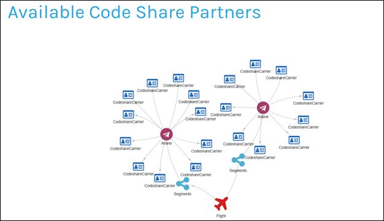
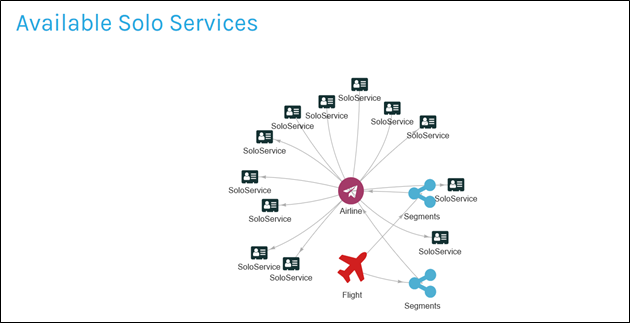
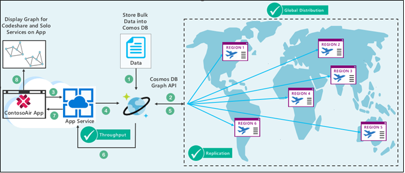

# Analyzing Data relationship using the Power of Azure Cosmos DB Graph API (Gremlin Query)

# User Story

Consider the user scenario, Kevin and his daughter Alina went for holidays and suddenly Kevin wants to travel by air, he booked his ticket with a specific airline. But, in a situation, he may experience that he is not going to travel with the same airline, which he has booked for, but with a different airline. This happens because of codeshare, which is a business agreement where two or more airlines share the same flight. Also, he wants to avail the Flying solo service facility for his daughter Alina. As a user, it will be more descriptive and user friendly to check the Codeshare and Solo Service details in graphical format.

So, to accomplish this scenario, we will use the **ContosoAir** demo app to learn **Cosmos DB Graph API(Gremlin query)** by searching the flights to check Codeshare and Solo Service Details in graphical format.

 

 

## Components Used in Scenario

 

**Azure Cosmos DB:** It is Microsoft's globally distributed, multi-model database. With the click of a button, Azure Cosmos DB enables you to elastically and independently scale throughput and storage across any number of Azure's geographic regions. It offers throughput, latency, availability, and consistency guarantees with comprehensive Service level agreements(SLAs), something no other database service can offer. ([Azure Cosmos DB](https://docs.microsoft.com/en-us/azure/cosmos-db/))

**Azure Cosmos DB Graph API:** Azure Cosmos DB is a globally distributed multi-model database. One of the supported APIs is the Graph (Gremlin) API, which provides a graph data model with Gremlin query/traversals. Graph databases let you model and store graphs naturally and efficiently, which makes them useful for many scenarios. Graph databases are typically NoSQL databases because these use cases often also need schema flexibility and rapid iteration. Graphs offer a novel and powerful data modeling technique. ([Azure Cosmos DB Graph API](https://docs.microsoft.com/en-us/azure/cosmos-db/graph-introduction))

**Gremlin Query:** Gremlin is a domain specific language used for traversing graphs. It is used to retrieve the data from Azure Cosmos Graph DB. This language has application in the areas of graph query, analysis, and manipulation. Gremlin is a path-oriented language which expresses complex graph traversals and mutation operations. SQL Queries are complex and indeed lengthy whereas using Gremlin, we can optimize the query and shorten it. ([Gremlin Query](https://docs.microsoft.com/en-us/azure/cosmos-db/gremlin-support))

## What you will learn from this lab

- Creating **Azure Cosmos DB Service** using **Graph API**.
- Playing around the code in **Visual Studio 2017 IDE** for creating collection.
- Playing around the code in **Visual Studio 2017 IDE** for uploading data into **Azure Cosmos Graph DB**.
- Fetching flight details from **Azure Cosmos Graph DB** using **Gremlin Query** andgraph plottingusing **Graph Explorer** feature.
- Fetching Codeshare and Solo Service details from **Azure Cosmos Graph DB** using **Gremlin Query.**
- Playing with **ContosoAir** app for Graph plotting of Codeshare and Solo Service details using **Graph API**.

> **Ready? Lets get started!**
