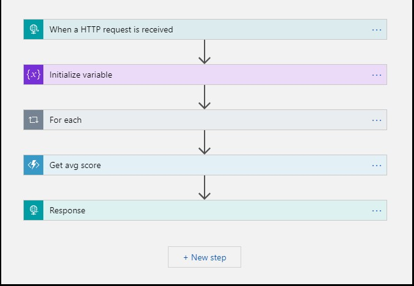
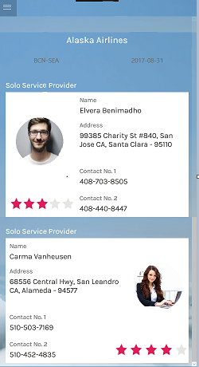
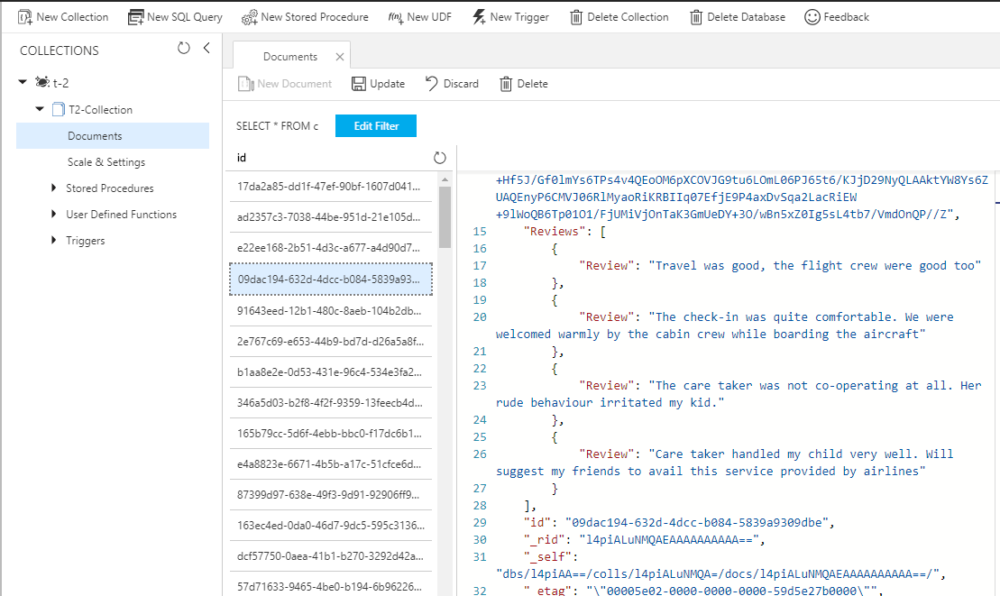
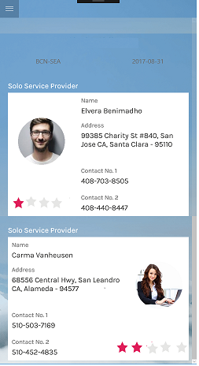

<page title="Fetching the reviews of staff serving the Flying Solo Service along with star ratings"/>

   > _So, let's start with modifying the Logic App._

## Scenario 2 – Fetching the reviews of staff serving the Flying Solo Service along with star ratings

### Part A – Building the Logic App with integration of Text Analytics service

   > _So, here you already have Logic App created. All you need to do is integrate Azure function in existing Logic App._

1. Go to **Resource groups** option present in the favourites menu on the left side panel and select **Resource Group** named **<inject story-id="story://Content-Private/content/dfd/SP-GDA/gdaexpericence3/story_a_notificationservice_with_cosmosdb" key="cosmosDbAcc"/>**.
1. Go to **Cognitive Service** named **<inject story-id="story://Content-Private/content/dfd/SP-GDA/gdaexpericence3/story_a_notificationservice_with_cosmosdb" key="cognitiveService"/>
** click on **Keys** option copy **Key 1** by clicking on **Copy URL icon.** 
1. Go to **Resource groups** option present in the favourites menu on the left side panel and select **Resource Group** named **<inject story-id="story://Content-Private/content/dfd/SP-GDA/gdaexpericence3/story_a_notificationservice_with_cosmosdb" key="cosmosDbAcc"/>**
1. Go to **Text Analytics** named **<inject story-id="story://Content-Private/content/dfd/SP-GDA/gdaexpericence3/story_a_notificationservice_with_cosmosdb" key="textAnalytics"/>** Click on **Edit API connection** option present under **cognitiveservicestextanalytics** blade and paste copied key into **Account Key** textbox and click on **Save** button.
1. Switch to **Azure Portal** as launched in **Part A** of **Scenario 1.**
1. Go to **Resource groups** option present in the favourites menu on the left side panel and select **Resource Group** named **<inject story-id="story://Content-Private/content/dfd/SP-GDA/gdaexpericence3/story_a_notificationservice_with_cosmosdb" key="cosmosDbAcc"/>**
1. Click on **Logic app** named **<inject story-id="story://Content-Private/content/dfd/SP-GDA/gdaexpericence3/story_a_notificationservice_with_cosmosdb" key="logicApp"/>** then click on **Logic app designer** option present under **AnalyzeReviews** blade.
1. Click on  icon and select **Add an Action** option present in between **For each** and **Response** step.
 
   

1. Search **Azure function** in the search box and select it by clicking on it.
1. Choose **Azure function app** and click on **Create new function.**
1. Add below code snippet in **Request body**.

   ```json
    {
	"review_count": "@length(triggerBody())",
	"total_score": "@variables('Total_Score')"
    }

   ```

   > ***Note:** The code snippet contains **JSON** body which we are passing to **Azure function**.
   >It includes:
   >- **review\_count** – to represent total reviews
   >- **@length(triggerBody())** - To place total reviews count in JSON body
   >- **total\_score** – to calculate sum of all reviews
   >- **@variable('Total\_Score')** - To Place Total\_score value in JSON body

1. Click on **Next** button.
1. Enter Function name **"Get\_avg\_score"** andadd provided code snippet in code section.

    ```nodejs
    module.exports = function (context, data) {
    var total_score = data.total_score;
    var review_count = data.review_count;
    var average_score = parseFloat(total_score)/parseFloat(review_count);
    //Response of the function to be used later.
    context.res = {
    body:  average_score
    };
    context.done();
    };
    ```

   > **Note** : This code snippet of **Azure function** is responsible to find out the **average score** in which we are getting **total\_score** and **review\_count** from input data object and here we are calculating the **average score** and storing it into **average\_score** variable. The calculated **average score** **(average\_score)** will be returned in the body with the help of context object.

1. Click on **Create** button.

   >_Great! You have just integrated Azure functions in Logic app._

1. Click on **When a HTTP request is received** step of a logic app displayed in screenshot and Copy the **HTTP POST URL** from the expanded window as in Visual Studio we will consume that Logic app.

   


   > _Now, let's start with consuming Logic app into visual studio._

1. Switch to **Visual Studio 2017** IDE.
1. Paste the copied URL ( **Logic app URL** ) in Line No. 50 of **GlobalSettings**. **cs** file.
1. Now press **ctrl+S** button from the keyboard to save the changes in the code.

   Ex: - **public const string GetSoloServiceReviewUrl = "HTTP POST URL ";**

   > _Here we will start creating C# code to get reviews score using Azure function._

1. Go to **Dataservices** folder and click on it to expand it then, click on **SoloServiceProviders** and double click on **ISoloServiceProvider.cs** file.
1. Paste the given code snippet below in line number 12.


   ```C#
    Task<string> GetReviewScore(List<Reviews> Reviews);
    ```
   >**Note** : Here we declare **GetReviewScore(List<Reviews> Reviews)** method in **ISoloServiceProvider.cs** interface so that we can implement it into **SoloServiceProvider.cs** class.

1. Go to **Dataservices** folder and click on it to expand it then, click on **SoloServiceProviders** and double click on **ISoloServiceProvider.cs** file.
1. Put the below given Code Snippet after the **function** named - **"public async Task<string> GetReviewScore(List<Reviews> Reviews)"**

    ```C#
    public async Task<string> GetReviewScore(List<Reviews> Reviews)
    {
        HttpClient httpClient = CreateHttpClient();

        string serialized = await Task.Run(() => JsonConvert.SerializeObject(Reviews, _serializerSettings));
	
        HttpResponseMessage response = await httpClient.PostAsync(GetSoloServiceReviewUrl, new StringContent(serialized, Encoding.UTF8, "application/json"));

        await HandleResponse(response);

        string responseData = await response.Content.ReadAsStringAsync();

        return await Task.Run(() => (responseData));
    }
    ```

    >This Function will retrieve the information along with ratings of staff serving the Flying Solo Service from Logic App.


    > **Note** :
    >- The **GetReviewScore(List<Reviews> Reviews)** method is responsible for calling the Logic App to and to get the average score. It accepts List of reviews **(List<Reviews> Reviews)** as an input parameter and return string containing the average score.
    >- **List<Reviews>** convert into JSON object using **JsonConvert.SerializeObject()** method and store the converted JSON into serialized string variable.
    >- After that we will call Logic app using **httpClient.PostAsync()** method which accepts 2 parameters viz. first -**Logic App url(GetSoloServiceReviewUrl)** and second - **StringContent** object having JSON input data(serialized), encoding format (Encoding.UTF8) and data type("application/json").
    >- After getting response in r **esponseData** variable with the help of **ReadAsStringAsync()** method, we will return it to calling method.

1. Now go to **View Model** folder and click on it to expand and double click on **SoloServiceViewModel.cs** file.
1. To modify the method named **"InitializeAsync(****object **** navigationData)"** , add below code snippet after line no. 66.


   ```C#
   var Source_SoloService_Score = await _soloServiceProvider.GetReviewScore(SS.Reviews);
   SoloService.Source_SoloService_Score = float.Parse(Source_SoloService_Score, CultureInfo.InvariantCulture.NumberFormat) * 5;
   ```
   >This function will display the information of source staff serving the Flying Solo Service.

   > **Note** : Here we are setting property **Source\_SoloService\_Score,** by calling **GetReviewScore()** method which accepts **Reviews** as input parameter and return average score(ranges from 0 -1 floating number). Returned score will be converted into floating number and multiplied by 5 for plotting reviews star ratings on UI.

1. Now Add below code snippet after line 82.
1. Now press **ctrl+S** button from the keyboard to save the changes in the code.

   ```C#
   var Dest_SoloService_Score = await _soloServiceProvider.GetReviewScore(SS.Reviews);
   SoloService.Dest_SoloService_Score = float.Parse(Dest_SoloService_Score, CultureInfo.InvariantCulture.NumberFormat) * 5;
   ```

   >This function will display the information of destination staff serving the Flying Solo Service.

   > **Note** : Here we are setting property **Dest\_SoloService\_Score** , by calling **GetReviewScore()** method which accepts Reviews as input parameter and return average score(ranges from 0 -1 floating number). Returned score will be converted into floating number and multiplied by 5 for plotting reviews star ratings on UI.

   


### Part B – Launching ContosoAir App

   > _Now we will check the reviews of respective staff serving the Flying Solo Service using_ **ContosoAir** _App._

1. Switch to **Visual Studio 2017** IDE. Then, go to **Solution Explorer** and expand **Contoair.client.Core (portable).**
1. Right click on the project and click on **Clean Solution.**
1. After the completion of this process, right click on the project and click **Rebuild Solution.**
1. Click on **Local Machine**  option given at top to launch the **ContosoAir App.**
1. Here you will get details of staff serving Flying Solo Service of the airlines with Star ratings.

   

1. Click on **Hamburger** icon and Select **Solo Service** option.

   

   > _Congrats! You have successfully retrieved the details of staff serving the Flying Solo Service along with their ratings._

   > _Now what if you want to change the reviews of staff serving the Flying Solo Service?_

   > _So, let's start implementation of this scenario by playing with Azure Cosmos DB._

### Part C – Change the reviews of staff serving the Flying Solo Service

1. Switch to **Azure Portal** as launched in **Part A of scenario 1.**
1. Click on Azure Portal's **Resource Group** menu present in the favourites blade in the left side panel.
1. Click on **"SoloServiceCosmosDB"** then, go to **Data Explorer** option.
1. Click on created collection **"SoloServiceData"** t_Niceo expand it and then click on **Documents.**
1. You can check details of Staff serving Flying Solo service by clicking on their respective ID's.
1. Select on any one of the ID's to change the **Reviews** of that respective Staff member from as per your need.

   

1. Now, Switch to **Visual Studio 2017** IDE. Then, go to **Solution Explorer** and expand **Contoair.client.Core (portable).**
1. Right click on the project **ContosoAir.Clients.Core (Portable)** in **Solution Explorer** and click on **Clean Solution** option.
1. After the completion of this process, again right click on the project and select **Rebuild Solution**.
1. Click on **Local Machine**
 Option given at top to launch the **ContosoAir App**.
 
1. Here you will get details of staff serving the Flying Solo Service of respective airlines with changes in their reviews i.e. Star ratings.

   

   > _Nice work! You have successfully made changes in respective staff's review and here you can see the changes in Star ratings._