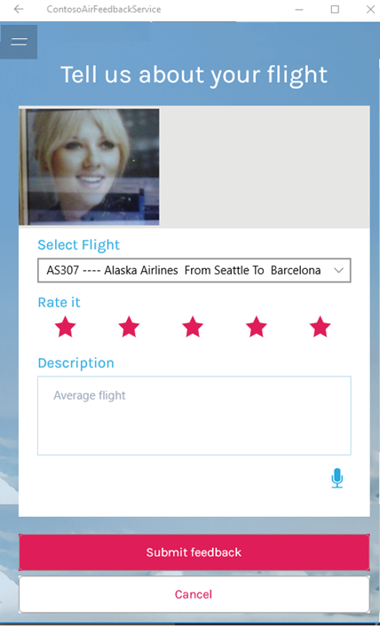
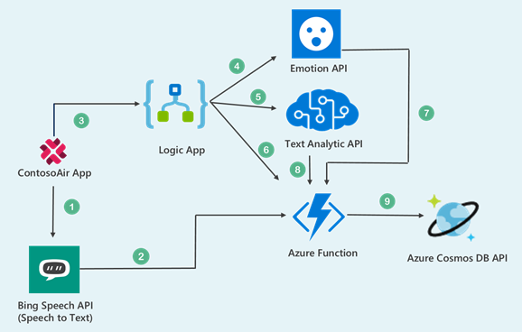

# Integrating Cosmos DB (SQL API) and Cognitive Services with Universal Windows Platform Application

## User Story

Consider the user scenario, Alina completes her journey from Seattle to Barcelona, after reaching her destination, she wants to share her flight experience by providing feedback through the ContosoAir application.

To solve this problem, we will use the ContosoAir app to learn the services like **Emotion API, Text Analytics API, Bing Speech API, Azure Function, Logic App** and **Cosmos DB** through the provision of providing feedback by analysing the facial expression and feedback description in the form of speech.

  

## Components Used in Scenario

  

- **Text Analytics API** is a cloud-based service that provides advanced natural language processing over raw text, and includes three main functions: sentiment analysis, key phrase extraction, and language detection. ([Text Analytics API](https://docs.microsoft.com/en-in/azure/cognitive-services/text-analytics/overview))
- **Emotion API** takes a facial expression in an image as an input and returns the confidence across a set of emotions for each face in the image, as well as bounding box for the face, using the Face API. ([Emotion API](https://azure.microsoft.com/en-in/services/cognitive-services/emotion/))
- **Bing Speech API** Converts spoken audio to text. The Speech to Text API enables you to build smart apps which are voice triggered. ([Bing Speech API](https://azure.microsoft.com/en-in/services/cognitive-services/speech/))
- **Azure Functions** is a server-less compute service that enables you to run code on-demand without having to explicitly provision or manage infrastructure. Use Azure Functions to run a script or piece of code in response to a variety of events. ([Azure Functions](https://docs.microsoft.com/en-us/azure/azure-functions/))
- **Logic Apps** provide a way to simplify and implement scalable integrations and workflows in the cloud. It provides a visual designer to model and automate your process as a series of steps known as a workflow. ([Logic Apps](https://docs.microsoft.com/en-us/azure/logic-apps/))
- **Azure Cosmos DB** is Microsoft's globally distributed, multi-model database. With the click of a button, Azure Cosmos DB enables you to elastically and independently scale throughput and storage across any number of Azure&#39;s geographic regions. It offers throughput, latency, availability, and consistency guarantees with comprehensive service level agreements (SLAs), something no other database service can offer. ([Azure Cosmos DB](https://docs.microsoft.com/en-us/azure/cosmos-db/))

## What you will learn from this lab

- Create database with collections of SQL API and insert data of Flight in Cosmos DB using **Data Migration Tool**.
- Creating **Azure Functions** to retrieve data of flights from **Cosmos DB** and insert the Feedback Data into **Cosmos DB**.
- Creating **Logic App,** integrating with connectors like HTTP Request and Response template, **Text Analytics (Cognitive Service)** and **Azure Function.**
- Playing around code in **Visual Studio 2017** IDE.

>_Ready? Let's get started!_