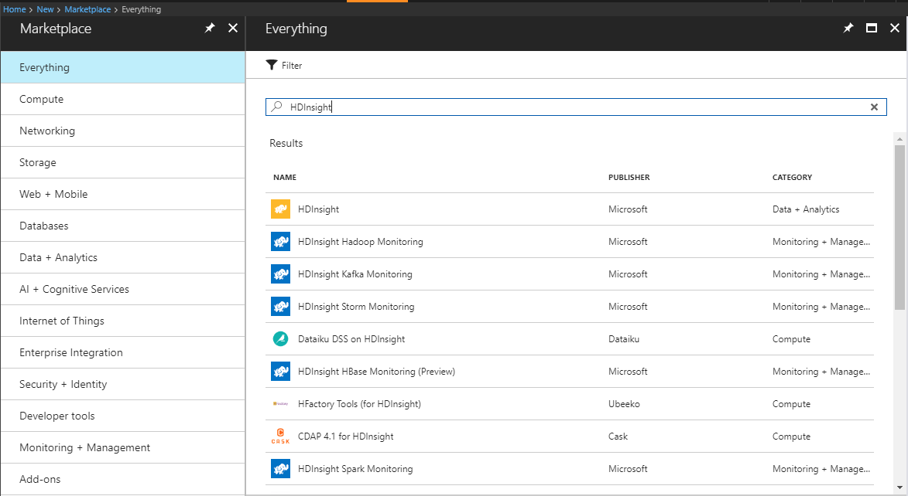
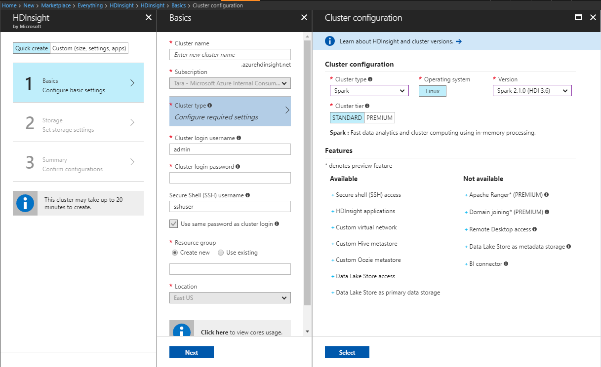
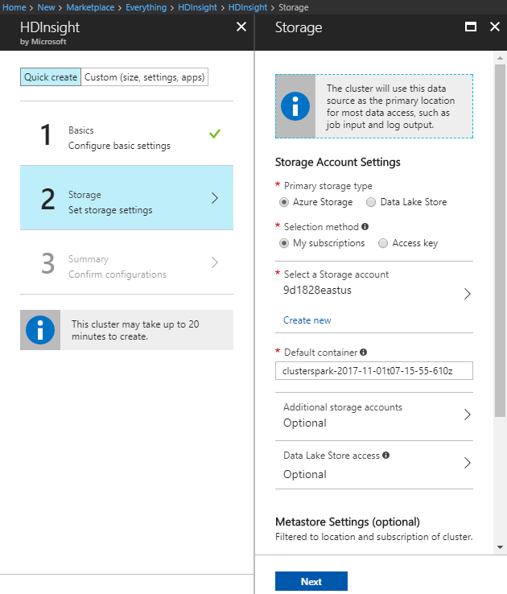
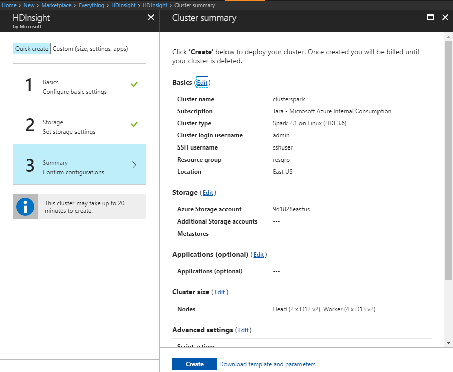
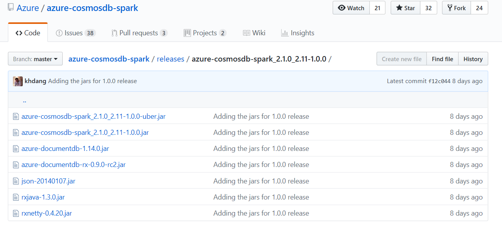
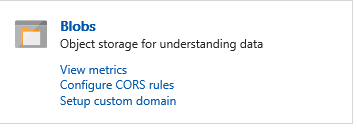
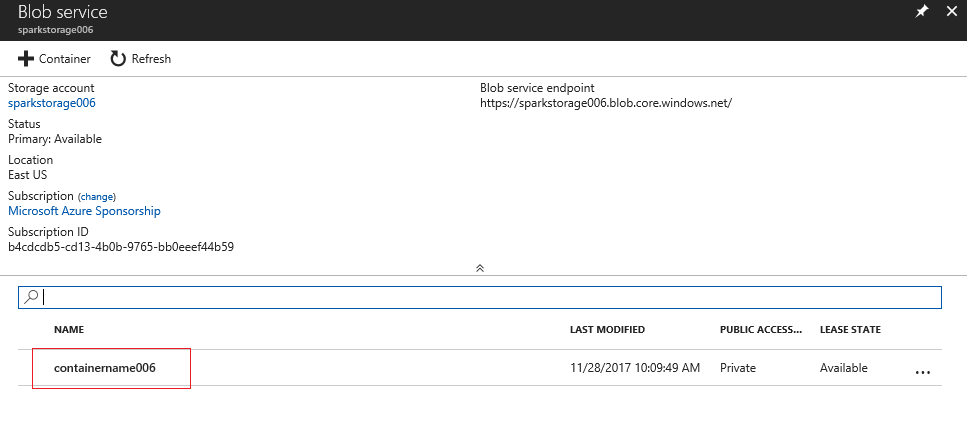
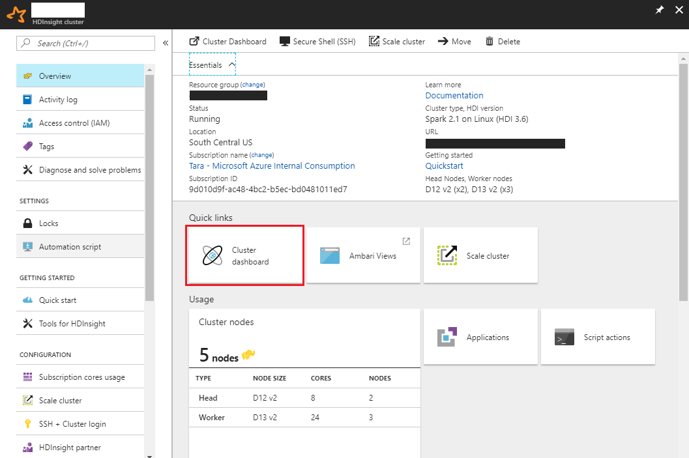
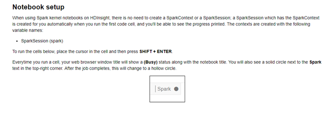
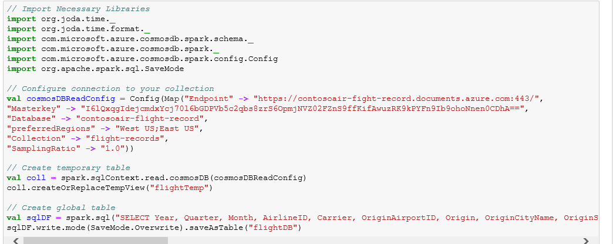

<page title="Creating Spark Cluster in HDInsight"/>

## Scenario 1 -  Creating Spark Cluster in HDInsight

### Part A - Accessing the Azure portal

   > _We'll start with accessing **Azure Portal**. For creating resources, you need to *Sign in* to *Azure Portal.* The steps to do the same are given below._

1. Click on the link [http://portal.azure.com](launch://launch_azure_portal) to open **Azure Portal** and maximize the browser window.
1. Sign in with your Azure Username and Password
   - Username: **<inject key="AzureAdUserEmail" />**
   - Password: **<inject key="AzureAdUserPassword" />**
1. Click on **Sign in** button .
1. If you see the **Stay signed in?** screen next, select the **Yes** button to continue.
1. You may encounter a popup entitled **Welcome to Microsoft Azure** with options to **Start Tour** and **Maybe Later** – *Choose Maybe Later*. [Ignore the Step no. 4 if didn't get the popup message.]

   > _Great! You are now logged in to the Azure Portal_.


### Part B – Spark Cluster Creation

   >_Let's start with creation of Spark Cluster in this scenario._

1. Go to **Azure portal**, click on  icon and search for **HDInsight** in the search bar and press **enter** button.

    

1. Click on **HDInsight** and then click **Create** button present at the bottom of the page.
1. Now, enter cluster name **SparkCluster<inject story-id="story://Content-Private/content/dfd/SP-GDA/gdaexpericence4/story_a_spark_with_cosmosdb" key="myResourceGroupName"/>** in the **cluster name** text field.
1. Select subscription from **Subscription** dropdown.
1. Click on the **Cluster type** for Configuring required settings.
1. In **Cluster Configuration** blade, select **Spark** from **Cluster Type** dropdown.

    

1. Click on **Select** button.
1. In **Basics** blade, enter password **P@$$w0rd123** in **Cluster login password** field.
  
   >**Note**: Please make sure no blank space gets added at the start or end while copying password.
   
1. In **Resource Group** field, click on **Use Existing** radio button and select resource group **<inject story-id="story://Content-Private/content/dfd/SP-GDA/gdaexpericence4/story_a_spark_with_cosmosdb" key="myResourceGroupName"/>** from dropdown. 
1. Click on **Next** button.
1. You will be automatically redirected to **Storage Account Settings** section in Storage blade.
1. In **Select a Storage account** section, click on **Create new** link and add **<inject story-id="story://Content-Private/content/dfd/SP-GDA/gdaexpericence4/story_a_spark_with_cosmosdb" key="storageaccname"/>** value in **Create a new Storage account** field.
1. In **Default Container** field, provide **<inject story-id="story://Content-Private/content/dfd/SP-GDA/gdaexpericence4/story_a_spark_with_cosmosdb" key="containername"/>** value.
1. Now click on **Next** button.

    

1. Validate all the details in **Cluster Summary** blade and click on **Create** button.

    

1. To view the deployment process, click **Notification Icon**  .

   >**Note**: It takes 10 to 15 minutes to complete the deployment of the resources.

   >_Nice work! You have successfully created Spark Cluster in HD Insight. Next, we will see how to upload the Cosmos DB Spark Connector to Storage Account._

### Part C – Uploading Cosmos DB Spark Connector in Storage Account

   >_In this part, we will be downloading the jar files that we need to upload in our Storage Account as these files will be working as a connector in between the Spark Cluster and Cosmos DB._

1. For downloading **Azure DocumentDb** and **Azure CosmosDb Spark** jar files, please navigate to **[Azure DocumentDb](https://github.com/Azure/azure-cosmosdb-spark/tree/master/releases/azure-cosmosdb-spark_2.1.0_2.11-1.0.0)**
    
   

1. To download **Azure DocumentDb** jar file, select file and click on **View Raw**. Navigate back and perform the same steps to download the **Azure CosmosDb Spark** jar file.

    

    

1. Now go back to **Azure Portal** launched in **Part A** of **Scenario 1**.
1. Navigate to **All resources** displayed in left hand pane 
1. Search for your **Storage Account** named **<inject story-id="story://Content-Private/content/dfd/SP-GDA/gdaexpericence4/story_a_spark_with_cosmosdb" key="storageaccname"/>** created in **Scenario 1 – Part B** and select it.
1. Click on **Blobs** option displayed in **Services** section.

    

1. Select the Container **<inject story-id="story://Content-Private/content/dfd/SP-GDA/gdaexpericence4/story_a_spark_with_cosmosdb" key="containername"/>** displayed in **Blob Service** window.

    

1. Click on **Example** folder present in **Container** blade and navigate to **jars** folder.
1. Click on **Upload** button present at top of the blade. 
1. In **Upload blob** blade, select the both downloaded jar files for - **Azure DocumentDb** and **Azure CosmosDb Spark** present in **Downloads** section one by one and upload them.
    
    


   >_Great! You have successfully uploaded Cosmos DB Connector files to Storage Account. Now let's have a close look at Jupyter notebook._


### Part D - Creating Data frames from the Azure CosmosDB Collection using Jupyter notebook

1. Navigate to **All resources** displayed in left hand pane 
1. Search for your **Spark Cluster** named **SparkCluster<inject story-id="story://Content-Private/content/dfd/SP-GDA/gdaexpericence4/story_a_spark_with_cosmosdb" key="myResourceGroupName"/>** created in **Scenario 1 – Part B** and click on it.
1. Click on **Cluster Dashboard** option displayed in **Quick links** section.

   

1. In **Cluster Dashboards** blade, click on **Jupyter Notebook**.
1. Now you will be redirected to **Jupyter Notebook** page.
1. It may prompt you to enter **username** and **password**.
1. Enter username **admin** and password **P@$$w0rd123** which was set in **Scenario 1 – Part B**.
  
   >**Note**: Please make sure no blank space gets added at the start or end while copying password.
  
1. To download the **Jupyter notebook**, copy below given command and run it by launching the **Command Prompt** present on desktop.
   ```cmd
      git clone https://github.com/Click2Cloud/gdaexperience4-PowerBI C:\source 
   ```
1. Now, navigate back to Jupyter notebook page and upload the Jupyter notebook **Flight Performance Report.ipynb** present at location **C:\source** by clicking on **Upload** button and then selecting your notebook.

   

1. After uploading **Jupyter** **notebook**, double click on it to open and refer the instructions given in **Notebook setup** section.
    
   

1. Follow all the instructions mentioned in **Notebook** and execute all the commands.
  
   >Note: To run the cells present in notebook, place the cursor in the cell and then press SHIFT + ENTER.
   
   >Note: Everytime you run a cell, your web browser window title will show a (Busy) status along with the notebook title. You will also see a solid circle next to the Spark text in the top-right corner. After the job completes, this will change to a hollow circle.  
   
   

   


   >_Great job!!! You are now done with all the tasks related to Spark Cluster._
