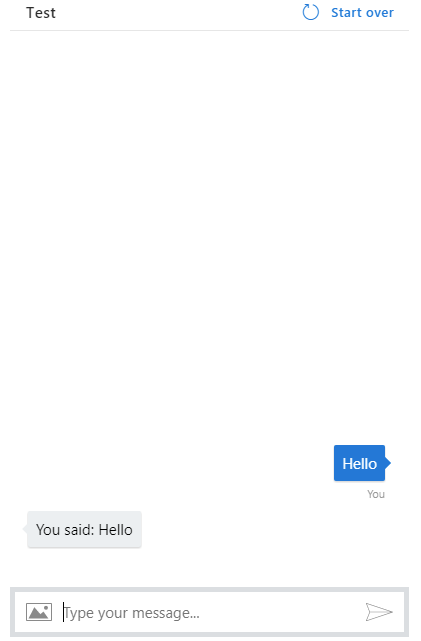

<page title="Creating Azure Bot"/>

## Scenario 1 -  Creating Azure Bot

   > _We'll start with accessing **Azure Portal.** For creating resources, you need to **Sign in** to **Azure Portal.** The steps to do the same are given below:_

1. Click on the link [http://portal.azure.com](launch://launch_azure_portal) to open **Azure Portal** and maximize the browser window.
1. Sign in with your Azure username and password
    - Username: **<inject key="AzureAdUserEmail" />**
    - Password: **<inject key="AzureAdUserPassword" />**
1. Click on **Sign in** button. 
1. You may encounter a popup entitled **Welcome to Microsoft Azure** with options to **Start Tour** and **Maybe Later** –Choose **Maybe Later**. [Ignore the Step no. 4 if didn't get the popup message]
   > _Great! You are now logged in into the Azure Portal. Next, we will see how to create Azure Bot Service._
5. Click on the **Resource groups** option present under icon  and select **<inject story-id="story://Content-Private/content/dfd/SP-GDA/gdaexpericence5/story_a_azurebotservice_with_cosmosdb" key="myResourceGroupName"/>** resource group present under **Resource groups blade**.
1. Now click on **<inject story-id="story://Content-Private/content/dfd/SP-GDA/gdaexpericence5/story_a_azurebotservice_with_cosmosdb" key="contosoAirBot"/>** present in right side panel with **Type** as **App Service**.
1. Select **C#** from **choose a template** option then click on **Basic** template and click on **Next** button.
1. Click on **Create Microsoft App ID and password** button. 
   It will redirect you to another tab for generating **App ID** and **Password**.
1. In the **Email** field, enter **<inject key="AzureAdUserEmail" />** 
1. In the **Password** field, enter **<inject key="AzureAdUserPassword" />**
1. Click on **Sign in** button to register the bot on **Application Registration Portal**.
1. Create a **Notepad** file **Credential.txt** on desktop, copy & paste the **App ID** into it and save the file.
   > **NOTE:** While copying the credentials in **Credentail.txt** file, Make sure that they are **labeled** properly for further inconvenience.
   
   ```txt
   App ID :
   Password :
   URI :
   PRIMARY KEY :
   PRIMARY CONNECTION STRING :
   APIEndpointURL : 
   ```                 
1. Now again come back to the browser and click on 
   button to generate the **App Password**. It will generate the pop-up window containing **App password**.
1. Copy generated password into the **Notepad** file named as **Credential.txt** present on the **Desktop** and save the file.
1. Again, come back on the browser and click on **Ok** button.
1. Click on 
   button and paste the **App Password** copied from Step 14 into field **Paste password from the Microsoft App registration portal**.
1. Select **both** the checkboxes 
   for accepting **Terms** and **Privacy Conditions**.
1. Finally click on **Create bot** button to deploy the Bot on Azure.

   >**NOTE:** Please wait, it takes some time to complete the Bot deployment process.

1. After successful completion of the deployment process you will be redirected to the **BUILD** tab 
1. Click on **Download zip file** option present under **Download source code** section to download the source code of created Bot.
1. It will generate the pop-up prompting to save the downloaded source code, click on **Save** button.
1. To test your Bot, click on the **Test** button provided on right side of the page. 
1. Type your text message in the provided text field and press **Enter** button. The Bot will reply you intelligently.
   

   > _Nice work! You have successfully created Bot._